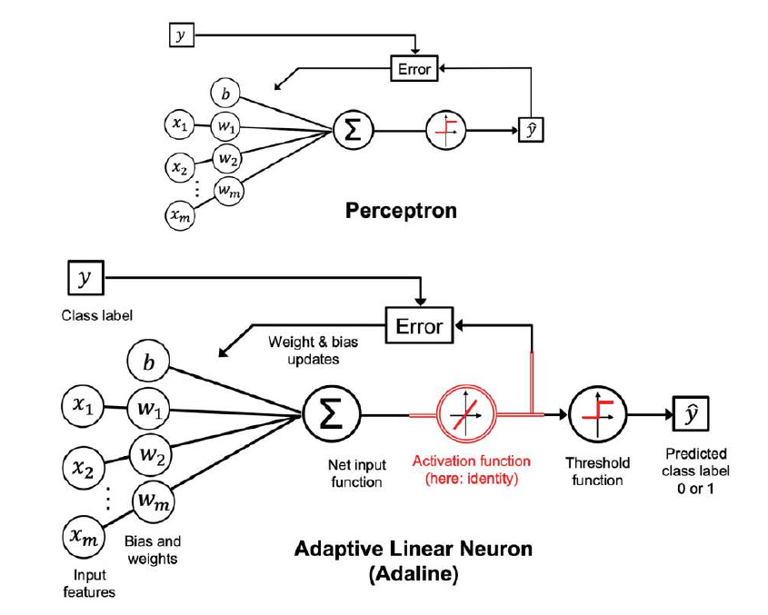
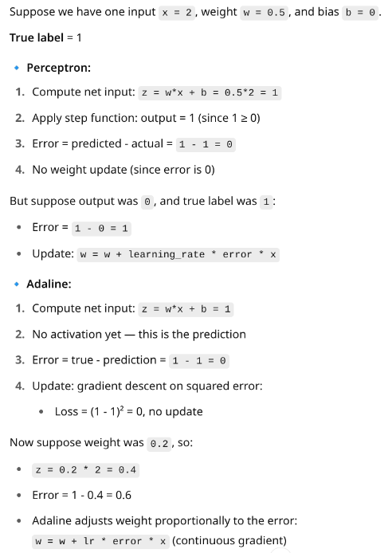

# linear classifiers for supervised learning
- visual representation: https://www.youtube.com/watch?v=aircAruvnKk&list=PLZHQObOWTQDNU6R1_67000Dx_ZCJB-3pi&index=1&t=3s 
 ## weight vs bais
- Weight = “How important is this input?”. heavyly determines how the output will be.
- Bias = “What should the output be when inputs are zero?” basal value. we can use it to fit into the range. suppose the bias is -10 then should should be more than 10 technically to activate
- Both are learned by the model during training.
## single layer neural network
 
  - percepton( for linear binary classification)
    - https://www.youtube.com/watch?v=OFbnpY_k7js&t=92s
    - earliest one.(1958)
  - ADAptive LInear NEuron (Adaline). (1960)
    - impoved on top of perceptron. 
    - starting point of lot of algos like linear regression etc
    - Adaline updates weights using the continuous output (before activation), while Perceptron updates using the final predicted class (after activation).
 - In Perceptron:
Predicted = class after applying step function
True (Actual) = the known label from the dataset
Weight update:
error = true - predicted
e.g., 1 - 0 = 1 if model predicted wrongly
In Adaline:
Predicted = the raw output before threshold (net input)
True (Actual) = known label from dataset
Error:
error = true - predicted
e.g., if output was 0.4 and true is 1, error = 1 - 0.4 = 0.6
Then Adaline uses this continuous error to update weights via gradient descent. we calculate the gradient based
on the whole training dataset

 

- learning rate, ( lr ), as well as the number of
epochs ( n_iter ), are the so-called hyperparameters (or
tuning parameters) 

### gradient decent
- local minima
### stochastic gradient descent

### Mini-batch gradient descent