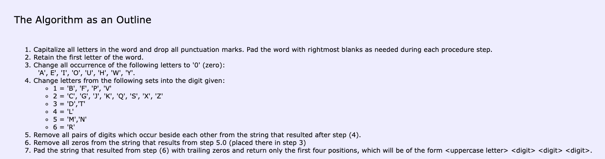
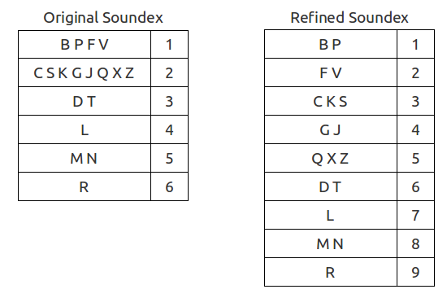

# Soundex algorithm
https://www.youtube.com/watch?v=zb_XUPe0oMk
https://creativyst.com/Doc/Articles/SoundEx1/SoundEx1.shtml

eg:
HERMAN" will code to "H06505" which will then reduce to "H655" in the last step.

- remember that no phonitic algorithm is perfect. its constantly evolving and needs to be modifed based 
on the area
- this they have a large false positive

# Refined Soundex algorithm:
- added more number of groups which is a refined version of soundex algorithm

**Original Soundex:**
F234 → Fusedale.
G535 → Genthner, Gentner, Gianettini, Gunton.
G640 → Garlee, Garley, Garwell, Garwill, Gerrell, Gerrill, Giral, Gorelli, Gorioli, Gourlay, Gourley, Gourlie, Graal, Grahl, Grayley, Grealey, Greally, Grealy, Grioli, Groll, Grolle, Guerola, Gurley.
H326 → Hadcroft, Hadgraft, Hatchard, Hatcher, Hatzar, Hedger, Hitscher, Hodcroft, Hutchcraft.
P630 → Parade, Pardew, Pardey, Pardi, Pardie, Pardoe, Pardue, Pardy, Parradye, Parratt, Parrett, Parrot, Parrott, Pearde, Peart, Peaurt, Peert, Perdue, Peret, Perett, Perot, Perott, Perotti, Perrat, Perrett, Perritt, Perrot, Perrott, Pert, Perutto, Pirdue, Pirdy, Pirot, Pirouet, Pirt, Porrett, Porritt, Port, Porte, Portt, Prate, Prati, Pratt, Pratte, Pratty, Preddy, Preedy, Preto, Pretti, Pretty, Prewett, Priddey, Priddie, Priddy, Pride, Pridie, Pritty, Prott, Proud, Prout, Pryde, Prydie, Purdey, Purdie, Purdy.

**Refined Soundex:**
B1905 → Braz, Broz
C30908 → Caren, Caron, Carren, Charon, Corain, Coram, Corran, Corrin, Corwin, Curran, Curreen, Currin, Currom, Currum, Curwen
H093 → Hairs, Hark, Hars, Hayers, Heers, Hiers
L7081096 → Lambard, Lambart, Lambert, Lambird, Lampaert, Lampard, Lampart, Lamperd, Lampert, Lamport, Limbert, Lombard
N807608 → Nolton, Noulton

One Soundex code value is matched for 21 surnames. In the case of an refined version of Soundex, 2-3 names match to the same code.

wade
vade
