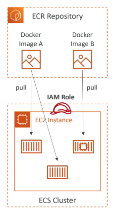

# containers on aws:

- Docker is a software development platform to deploy apps
- Apps are packaged in containers that can be run on any OS
Amazon ECR (Amazon Elastic Container Registry):
- repository of docker containers

## Docker Containers Management on AWS:
- Amazon Elastic Container Service (Amazon ECS)
- Amazon Elastic Kubernetes Service (Amazon EKS)
- AWS Fargate (we dont have to anything- everything is managed)
- Amazon ECR

### - Amazon Elastic Container Service (Amazon ECS):
- ec2 launch type 
- fargate launch type
- ECS Task Role is the IAM Role used by the ECS task itself. Use when your container wants to call other AWS services like S3, SQS, etc.
- EFS volume can be shared between different EC2 instances and different ECS Tasks. It can be used as a persistent multi-AZ shared storage for your containers.

### - Amazon ECR:
- Elastic Container Registry
- Amazon ECR is a fully managed container registry that makes it easy to store, manage, share, and deploy your container images. ECR is fully integrated with Amazon ECS, allowing easy retrieval of container images from ECR while managing and running containers using ECS.
- Store and manage Docker images on AWS (public as well as private repository)

### - amazon EKS:
- It is a way to launch managed Kubernetes clusters on AWS
- Kubernetes is an open-source system for automatic deployment, scaling and management of containerized (usually Docker) application
- It’s an alternative to ECS, similar goal but different API
- EKS supports EC2 if you want to deploy worker nodes or Fargate to deploy serverless containers
- Use case: if your company is already using Kubernetes on-premises or in another cloud and wants to migrate to aws using kubernetes
- remember: Kubernetes is cloud-agnostic (can be used in any cloud – Azure, GCP...)

### -aws fargate:
- AWS Fargate allows you to run your containers on AWS without managing any servers.
---
## AWS App Runner:
- when you dont know anything about aws and you want to deploy your app and cluster.
- Fully managed service that makes it easy to deploy web
applications and APIs at scale
- No infrastructure experience required
- Start with your source code or container image
- Automatically builds and deploy the web app
- Automatic scaling, highly available, load balancer, encryption
- VPC access support
- Connect to database, cache, and message queue services

- Use cases: web apps, APIs, microservices, rapid production
deployments
