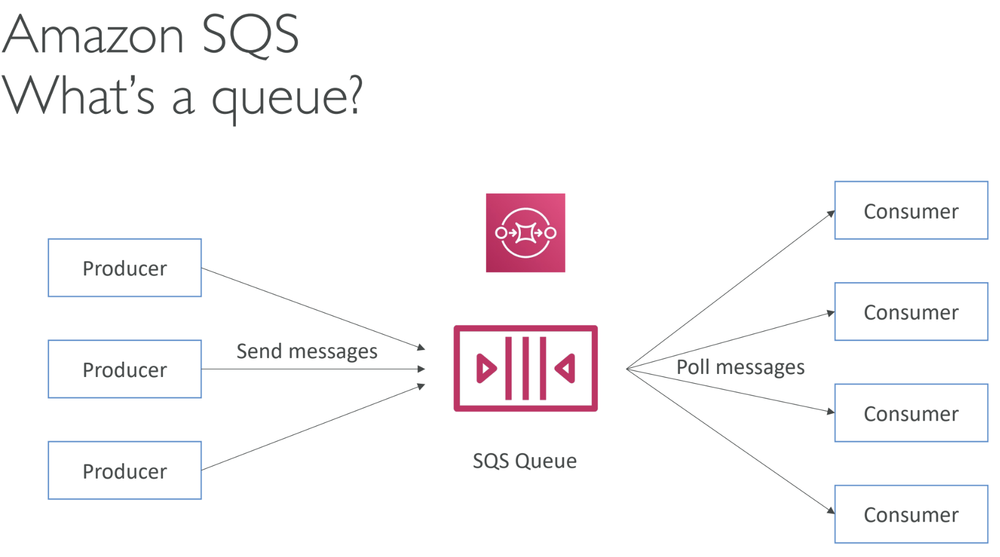
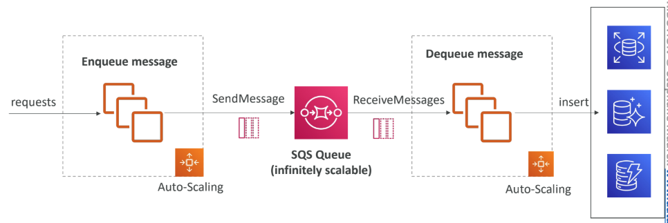
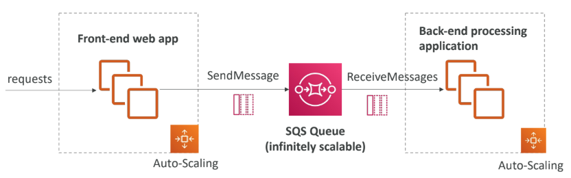
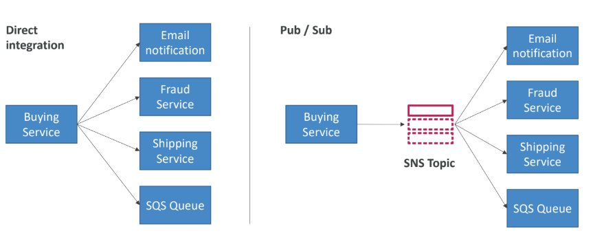
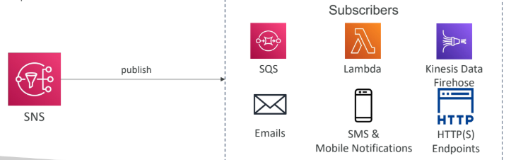
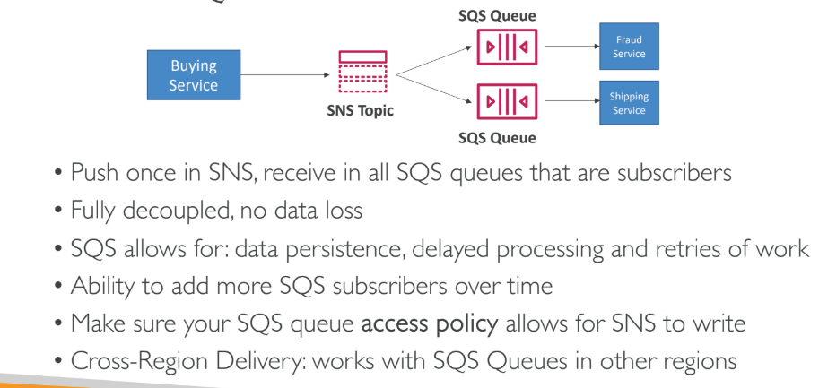
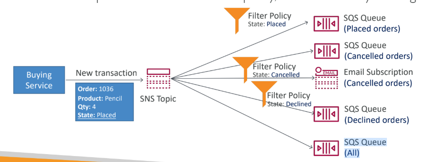

# Messaging 
### SQS:

- Default retention of messages: 4 days, maximum of 14 days
-  Limitation of 256KB per message sent
- Encryption:
  - In-flight encryption using HTTPS API
  - At-rest encryption using KMS keys
  - Client-side encryption if the client wants to perform encryption/decryption itself
- **SQS – Message Visibility Timeout:**
  -  After a message is polled by a consumer, it becomes invisible to other consumers
  - By default, the “message visibility timeout” is 30 seconds
  - That means the message has 30 seconds to be processed
  - After the message visibility timeout is over, the message is “visible” in SQS
- **Amazon SQS - Long Polling:**
  - When a consumer requests messages from the
queue, it can optionally “wait” for messages to
arrive if there are none in the queue
  - This is called Long Polling
  - LongPolling decreases the number of API calls
made to SQS while increasing the efficiency
and reducing latency of your application
   - Long Polling is preferable to Short Polling
- If the load is too big, some transactions may be lost. so we can use sqs as a internal write buffer

- we can also use sqs to differentiate application tires

---
### SNS:
- What if you want to send one message to many receivers?

- The “event producer” only sends message to one SNS topic
- As many “event receivers” (subscriptions) as we want to listen to the SNS topic notifications
- Each subscriber to the topic will get all the messages (note: new feature to filter messages)
-Up to 12,500,000 subscriptions per topic
- 100,000 topics limit

- Many AWS services can send data directly to SNS for notifications.
- **How to publish:**
  - create a topic
  - create a subscription(one or many)
  - publish the topic
### SNS + SQS: Fan Out:

- sns also has fifo similar to sqs
- **SNS filtering:**
- JSON policy used to filter messages sent to SNS topic’s subscriptions
- if a subscription doesnt have a filter policy it receives every message

