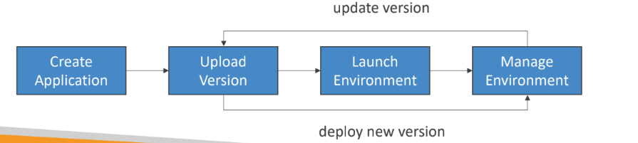

# Developer problems on aws
### Managing infrastructure
• Deploying Code
• Configuring all the databases, load balancers, etc
• Scaling concerns

• Most web apps have the same architecture (ALB + ASG)
• All the developers want is for their code to run!
• Possibly, consistently across different applications and environments
•  They just want to bootstrap quickly and start writing code while not dwelling deep into managing infra.
- elastic bean stalk is used for this reason
# Elastic BeanStalk
- Elastic Beanstalk is a developer centric view of deploying an application on AWS
- it is a managed service
  - Automatically handles capacity provisioning, load balancing, scaling, application health monitoring, instance configuration, ...
  - Just the application code is the responsibility of the developer
  - no cost for using beanstalk. we just have to pay for the underlying resources it provisions
- We still have full control over the configuration

# Components of elastic beanstalk
- Application:
- Application Version:
- Environment:

# types of environment:
1. worker:
  - the instances work like a worker eg processing long messages which involves tasks of a queue, just keep working
2. web:
  - our usual stuff, api layer, https request and so on

# what exactly happens:
**step1:**
you can configure bean stalk with whatever configurations you might need (a bunch of ec2,s alarms, databases like rds aurora etc etc) or build with default of default slate
**step2 :**
you can upload your code into beanstalk and it will automatically deploy the code with the infra you created for you
**step3 :**
they support lot of lang like golang,java, node js etc etc
**step 4:**
you can go to cloud formation and look at what infra our bean stalk has created for us or cross check with the infra it has built is same as the one we provisioned etc
**step 5:**
eventually beanstalk will set up our infra and deploy our code in it and will give us a end url through wich we can access everything
**step 6:** 
next version of code can be uploaded which will also be deployed and we can version back and forth
**step 7:** 
note that we have individual control over the infrastructure that has been created by bean stalk and we are priced based on the infra that bean stalk creates for us
