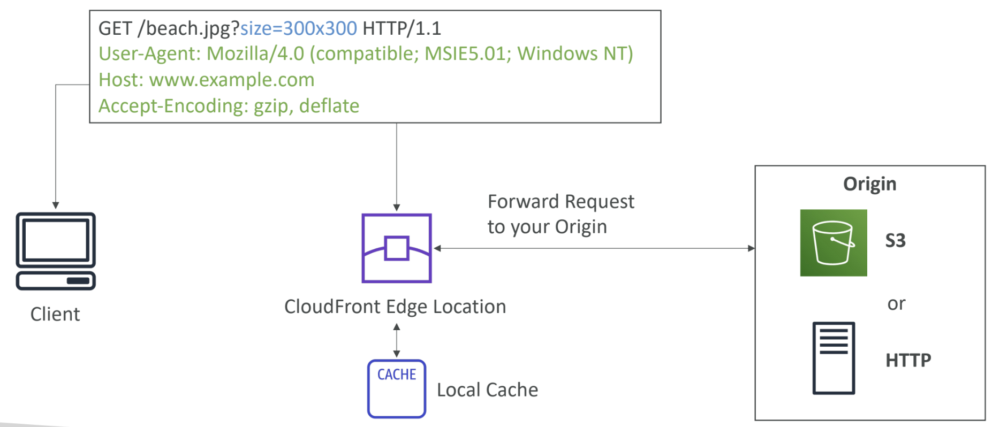
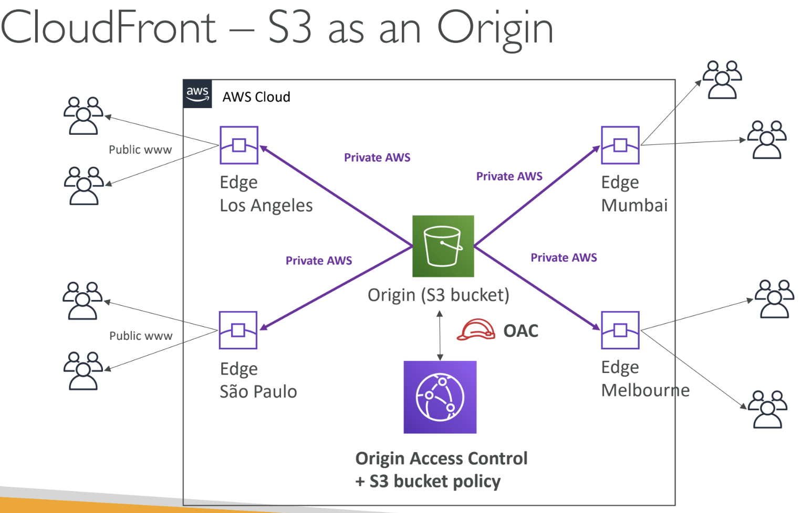
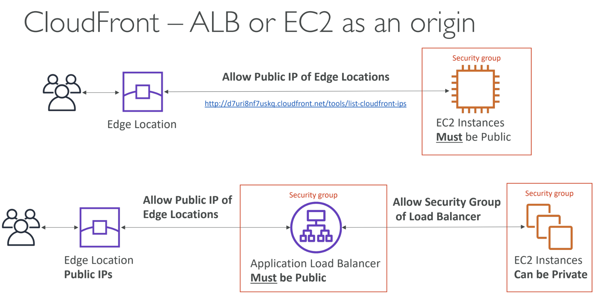
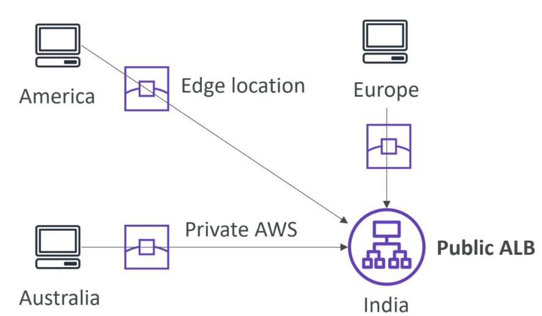

# cloudfront
- content Delivery Network(cdn)
- files are cached in an edge location (not forever just for a limited time and gets cached again and so on)
- best for static sites
- origin (aka what it needs to cache) can be a public s3 bucket or any backend which has http support(ec2,alb and so on)

---
### cloudFront Geo Restriction
- restrict which region (edge location) can and cannot access your distribution
- **Allowlist:** Allow your users to access your content only if they're in one of the
countries on a list of approved countries.
- **Blocklist:** Prevent your users from accessing your content if they're in one of the
countries on a list of banned countries.
- The “country” is determined using a 3rd party Geo-IP database
- can be used to block region wise copyright violation and so on
---
### cloudfront Pricing:
- pricing differs from region to region
- Three price classes:
1. **Price Class All:** all regions – best performance
2. **Price Class 200:** most regions, but excludes the most expensive regions
3. **Price Class 100:** only the least expensive regions
---
### CloudFront – Cache Invalidations
- In case you update the back-end
origin, CloudFront doesn’t know
about it and will only get the
refreshed content after the TTL has
expired
- However, you can force an entire or
partial cache refresh (thus bypassing
the TTL) by performing a CloudFront
Invalidation
- You can invalidate all files (*) or a
special path (/images/*)
- set up a origin access control(OAC) and update s3 buckey policy that will allow only from cloudflare to access the public bucket
---
## AWS Global Accelerator:

- Leverage the AWS internal
network to route to your
application
- 2 Anycast IP are created for your
application
- The Anycast IP send traffic directly
to Edge Locations
- The Edge locations send the traffic
to your application
- Good fit for non-HTTP use cases, such as gaming (UDP), IoT (MQTT), or Voice over IP
- Good for HTTP use cases that require static IP addresses
- Good for HTTP use cases that required deterministic, fast regional failover
