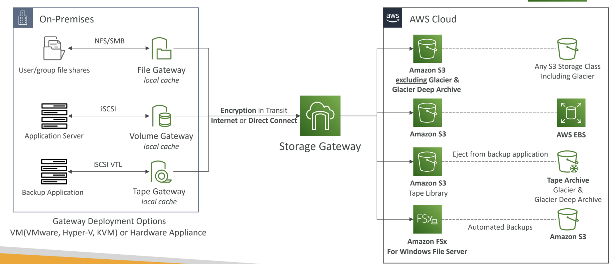
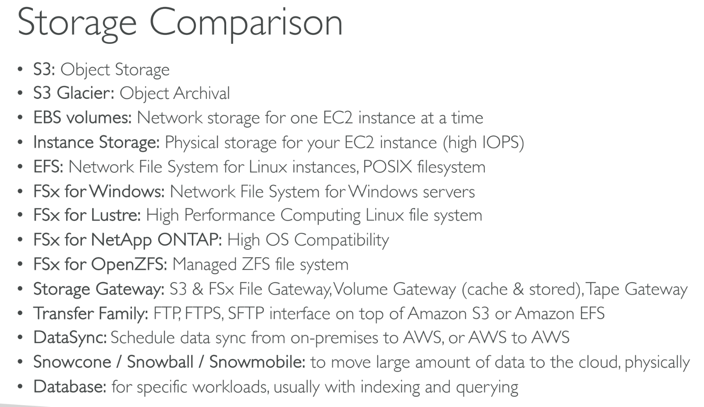

# EC2 instance storage
- EBS Volumes are created for a specific AZ. It is possible to migrate them between different AZs using EBS Snapshots.
- AMIs are built for a specific AWS Region, they're unique for each AWS Region. You can't launch an EC2 instance using an AMI in another AWS Region, but you can copy the AMI to the target AWS Region and then use it to create your EC2 instances.
- EFS is a network file system (NFS) that allows you to mount the same file system on EC2 instances that are in different AZs.
- **EC2 Instance Store** provides the best disk I/O performance but will diappear on termination
### EBS Volume types:
  - general Purpose ssd volumes
    - GP2
    - GP3
  - Provisioned IOPS ssd volumes
    - io1
    - io2 block express
  - throughput optimized ssd volume
    - st1
  - cold HDD volume
    - sc1
##### 1.general Purpose ssd volumes
- balances price and performance, normal,balanced good volume type
- cost effective
- gp3 is newer generation as compared to gp2 so higher iops
- useful for boot volume, test and development env, wherever things are balanced  

##### 2.Provisioned IOPS ssd volumes
- critical business needs where iops are more important
- best for database related works
- this type of volume supports ebs multiattach

##### 3. HDD
- cannot be used as boot volume
- st1 is throughput optimized which can be used for log processing,data warehousing etc
- sc1 is cold hdd which is slowest of all so can be used for infrequent access volumes

### EBS multiattach:
  - attach the same ebs volume for multiple ec2 but in the **same AZ** only  
  - certain types of ebs volumes are only allowed to do this (provisioned iops volumes io1 and io2)
  - can do read and write at the same time
  - can attach maximum of **16 ec2**
  - the ec2's must use a file system which is cluster aware ie xfs etc
---
## storage extra:
- Snowball Edge is the right answer as it comes with computing capabilities and allows you to pre-process the data while it's being moved into Snowball.
- AWS Transfer Family is a managed service for file transfers into and out of S3 or EFS using the FTP protocol, thus TLS is not supported.
### AWS Storage Gateway:
- AWS is pushing for ”hybrid cloud”
• Part of your infrastructure is on the cloud
• Part of your infrastructure is on-premises
- Types of Storage Gateway:
• S3 File Gateway
• FSx File Gateway
• Volume Gateway
• Tape Gateway

### storage comparision

AWS provides several services for data migration and transfer, each designed for specific use cases. Here's a comparison of **AWS DataSync**, **AWS Snowball**, and **AWS Transfer Family** to help you understand their differences and choose the right tool for your needs:

---

### **1. AWS DataSync**
- **Purpose**: Automated and high-speed data transfer between on-premises storage, edge locations, and AWS services (e.g., Amazon S3, EFS, FSx).
- **Use Cases**:
  - Migrating large datasets to AWS.
  - Replicating data between on-premises and AWS for backup or disaster recovery.
  - Syncing data across AWS storage services.
- **Key Features**:
  - **Speed**: Optimized for fast transfers using parallelization and compression.
  - **Automation**: Schedules and automates data transfers.
  - **Incremental Transfers**: Only transfers changes (delta) after the initial transfer.
  - **Security**: Encrypts data in transit and at rest.
  - **Integration**: Works with S3, EFS, FSx, and on-premises storage (NFS, SMB).
- **Best For**: Organizations needing frequent, automated, and fast data transfers between on-premises and AWS.

---

### **2. AWS Snowball**
- **Purpose**: Physical data transport for large-scale data migration or edge computing.
- **Use Cases**:
  - Migrating petabytes of data to AWS when network bandwidth is limited.
  - Transferring data from remote locations with poor connectivity.
  - Edge computing (with Snowball Edge devices).
- **Key Features**:
  - **Physical Device**: AWS ships a rugged storage device to your location.
  - **High Capacity**: Snowball devices can store up to 80 TB, and Snowball Edge devices up to 210 TB.
  - **Offline Transfer**: Ideal for large datasets that are impractical to transfer over the internet.
  - **Edge Computing**: Snowball Edge devices can run AWS Lambda functions and process data locally.
  - **Security**: Encrypted data and tamper-resistant devices.
- **Best For**: Large-scale, one-time data migrations or edge computing in remote locations.

---

### **3. AWS Transfer Family**
- **Purpose**: Managed file transfer service supporting SFTP, FTPS, and FTP protocols.
- **Use Cases**:
  - Enabling secure file transfers to and from AWS S3 or EFS using standard file transfer protocols.
  - Migrating legacy file transfer workflows to AWS.
  - Providing partners or customers with a secure way to upload/download files.
- **Key Features**:
  - **Protocol Support**: Supports SFTP, FTPS, and FTP.
  - **Integration**: Stores files directly in S3 or EFS.
  - **Authentication**: Integrates with AWS IAM, Microsoft Active Directory, or custom identity providers.
  - **Managed Service**: No infrastructure to manage; scales automatically.
  - **Security**: Encrypts data in transit and integrates with AWS security services.
- **Best For**: Organizations needing to support file transfer workflows using standard protocols.

---

### **Comparison Table**

| Feature                  | AWS DataSync                          | AWS Snowball                          | AWS Transfer Family                  |
|--------------------------|---------------------------------------|---------------------------------------|--------------------------------------|
| **Primary Use Case**     | Automated data transfer               | Large-scale offline data migration    | Managed file transfer (SFTP/FTPS/FTP) |
| **Transfer Method**      | Network-based                        | Physical device                       | Network-based                        |
| **Speed**                | High-speed (optimized)                | Limited by device capacity            | Depends on network and protocol      |
| **Automation**           | Yes (scheduled, incremental)          | Manual (device shipping)              | Yes (managed service)                |
| **Protocol Support**     | NFS, SMB                             | N/A                                   | SFTP, FTPS, FTP                      |
| **Integration**          | S3, EFS, FSx, on-premises storage     | S3                                    | S3, EFS                              |
| **Security**             | Encryption in transit/at rest         | Tamper-resistant, encrypted devices   | Encryption in transit, IAM integration |
| **Best For**             | Frequent, automated transfers         | Large, one-time migrations            | Legacy file transfer workflows       |

---

### **When to Use Which?**
- **AWS DataSync**: Use for frequent, automated, and fast data transfers between on-premises and AWS or across AWS services.
- **AWS Snowball**: Use for large-scale, one-time data migrations when internet bandwidth is insufficient or for edge computing in remote locations.
- **AWS Transfer Family**: Use when you need to support file transfer workflows using standard protocols like SFTP, FTPS, or FTP.

By understanding your data transfer requirements (e.g., volume, frequency, protocol, and connectivity), you can choose the most appropriate AWS service.
