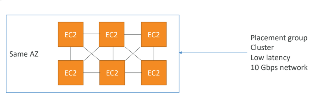
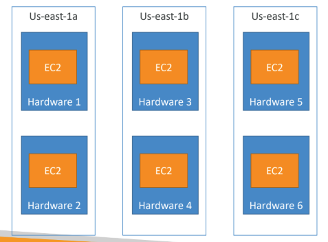
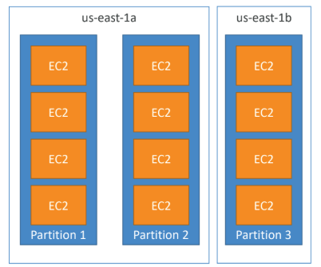

# Elastic cloud compute

## spot instance
- Can get a discount of up to 90% compared to On-demand
- Define max spot price and get the instance while current spot price < max
• The hourly spot price varies based on offer and capacity
• If the current spot price > your max price you can choose to stop or terminate your instance
  - stop: stop the instance for a while until the price goes below stop price
  - terminate: completely remove the instance
- Used for batch jobs, data analysis, or workloads that are resilient to failures. Not great for critical jobs or databases
## spot fleet:
Spot Fleets

• Spot Fleets = set of Spot Instances + (optional) On-Demand Instances
• The Spot Fleet will try to meet the target capacity with price constraints
• Define possible launch pools: instance type (m5.large), OS, Availability Zone
• Can have multiple launch pools, so that the fleet can choose
• Spot Fleet stops launching instances when reaching capacity or max cost
• Strategies to allocate Spot Instances:
• **lowestPrice:** from the pool with the lowest price (cost optimization, short workload)
• **diversified:** distributed across all pools (great for availability, long workloads)
• **capacityOptimized:** pool with the optimal capacity for the number of instances
• **priceCapacityOptimized (recommended):** pools with highest capacity available, then select
the pool with the lowest price (best choice for most workloads)

• Spot Fleets allow us to automatically request Spot Instances with the lowest price

---
## IP:
- ipv4
- ipv6
from feb 2024 there is a seperate cost for creating public ip v4. But v6 remains free
- ### private IP:
    - can be only accessed if in that network
    - we need to use some form of internet gateway to proxy this private IP and use it to access the internet
- ### pubic IP:
    - can be accessed through internet or anywhere
    - but everytime a EC2 instance is restarted the public IP changes
- ### elastic IP:
    - we can create something called elastic IP and allocate to whatever resouce we create (ec2, rds etc) so this ip is constant and we can access it through internet or anywhere
    - one disadvantage is it is costly (hourly pay both if we use or not use) and one account can create at max 5 elastic ip
 
 ---

## Placement group:
- sometimes we want to control how the ec2 intances are placed.
- this can be done through placement groups
- we can use one of the statergies to create placement group:
  - cluster
  - spread
  - partition
- ### cluster placement group:
  - best for low latency
  - cluster instances very nearby in the same AZ
  - the disadvantage of cluster placement group is if there is a AZ failure, we will loose everything
  
- ## spread placement group:
- best for high availability
  - spreads instances across underlying hardware (max 7 instances per
group per AZ)
  - EC2 Instances are on different physical hardware so less risk of failure
  - Limited to 7 instances per AZ per placement group
  
- ## partition placement group:
- Up to 7 partitions per AZ and each partition can have any number of ec2
- 1 patition is 1 hardware rack so all ec2 in a partition will ideally be in the same rack
- A partition failure can affect many EC2 but won’t affect other partitions
- EC2 instances get access to the partition information as metadata
  
---
- ## Elastic Network Interface:
- https://aws.amazon.com/blogs/aws/new-elastic-network-interfaces-in-the-virtual-private-cloud/
- Elastic Network Interfaces (ENIs) are bounded to a specific AZ. You can not attach an ENI to an EC2 instance in a different AZ.
- we are teasing apart the IP addresses (and important attributes associated with them) from the EC2 instances and calling the resulting entity an ENI, or Elastic Network Interface. Second, we are giving you the ability to create additional ENIs, and to attach a second ENI to an instance (again, this is within the VPC).
- ## EC2 Hybernate
  - hybernate is a state similar to terminate ,stop
  - used for fast bootup
  - in terminate or stop the ram is completely removed so any boot up (os,bootstrap script etc) will take time
  - but in hybernate mode we take a dump of the ram and store it  in our ebs encrypted root volume
  - so when we restart from hybernate it gets booted up fast as it uses this dump to restart thus maintaining the current state
  - as of now instance cannot hybernate more than 60 days

## how to instantiate application quickly
### for ec2 instances:
- create something called **golden AMI** which is a AMI with installed os,dependency everything
- install os,install dependency and create a AMI out of it (golden AMI)
- another method is to use **bootstrap script using user data** very useful for dynamic changes
- hybrid: mix of both AMI+ user data
### for rds databases and ebs volumes:
- take a snapshot and restore the snapshot for instantiating application quickly
