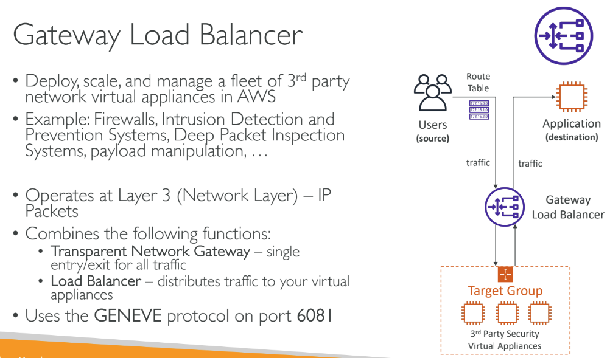
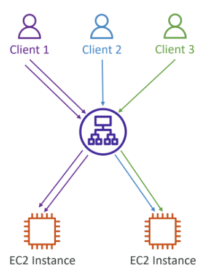

# LOAD BALANCER:
- application load balancer (ALB)
- network load balancer (NLB)
- gateway load balancer (GLB)

- Only Network Load Balancer provides both static DNS name and static IP. While, Application Load Balancer provides a static DNS name but it does NOT provide a static IP. The reason being that AWS wants your Elastic Load Balancer to be accessible using a static endpoint, even if the underlying infrastructure that AWS manages changes.

- When you enable ELB Health Checks, your ELB won't send traffic to unhealthy (crashed) EC2 instances.

- When Cross-Zone Load Balancing is enabled, ELB distributes traffic evenly across all registered EC2 instances in all AZs.

## Application Load Balancer (ALB):
- it is a layer 7 load balancer application layer(http https)
- When using an Application Load Balancer to distribute traffic to your EC2 instances, the IP address you'll receive requests from will be the ALB's private IP addresses. To get the client's IP address, ALB adds an additional header called "X-Forwarded-For" contains the client's IP address

#### steps on how it works:
- **step 1:** create a bunch of instances or a url or a ip where the alb needs to redirect traffic
- **step 2:** here we will create a bunch of instances. each instance will have its own security group for inbound or outbound trafic filteration.
- **step3:** group instances or ip or container or whatever toger using target group. ideally the alb will redirect target groups <a href= "https://docs.aws.amazon.com/elasticloadbalancing/latest/application/load-balancer-target-groups.html">target group</a>
- **step 4:** so note that alb will also have its own security group
- **step 5:** you can set up rules on how to route the traffic (based on url,ip,query param etc etc) and you can also set the priority of alb. you can also route to a custom message as well . ALBs can route traffic to different Target Groups based on URL Path, Hostname, HTTP Headers, and Query Strings.
- **step 6:** we can also make some changes in the security group of the instances such a way that it allows traffic only from the security group of loadbalancer(only from load balancer)

## Network Load Balancer (NLB):
- works at layer 4 (deals with tcp and udp traffic) and it is high performance,low latency
- Network Load Balancer has one static IP address per AZ and you can attach an Elastic IP address to it. Application Load Balancers and Classic Load Balancers have a static DNS name.

## Gateway load Balancer (GLB):
- route all traffic to instances that will do security tests. after successful the traffic will go back to GLB and it works like a normal lb and distribute the traffic to instances

## Sticky Session (session affinity):
- sticky session is that always we should reach a machine when we hit the loadbalancer. how much ever we refresh the page load balancer should reach the same machine
- same client is always redirected to the same
instance behind a load balancer
- This works for Application Load Balancer, and Network Load Balancer
- alb uses cookies to mainatain state. step 1 is to set a cookie name or auto in alb. the same cookie name should be set in our browser while hitting the alb. if auto then automatically a cookie is created and registered      

## Server Name Indication (SNI):
Server Name Indication (SNI) allows you to expose multiple HTTPS applications each with its own SSL certificate on the same listener. Read more here: https://aws.amazon.com/blogs/aws/new-application-load-balancer-sni/

## Auto Scaling Group:
- You can configure the Auto Scaling Group to determine the EC2 instances' health based on Application Load Balancer Health Checks instead of EC2 Status Checks (default). When an EC2 instance fails the ALB Health Checks, it is marked unhealthy and will be terminated while the ASG launches a new EC2 instance.
