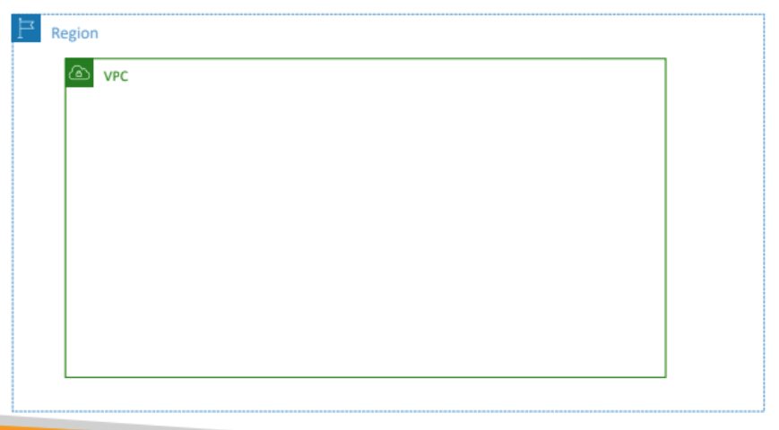
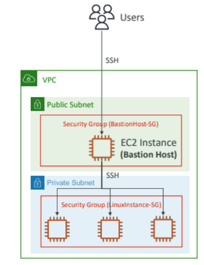
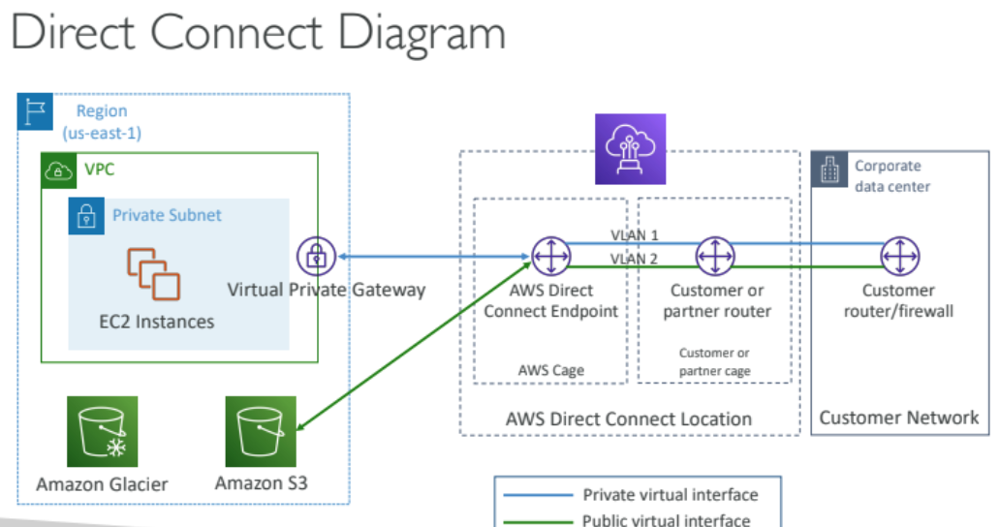

# NETWORKING AND VPC:

## CIDR,PUBLIC AND PRIVATE IPs:
 
- 192.168.0.0/24 -> 32-24 = 8
2^8 =256 IPs
192.168.0.0 TO 192.168.0.255 (266 NUMBERS from 0 to 255)

- 192.168.0.0/16 -> 32 -16 = 16
2^16 = 65536 IPs (which is 256*256)
192.168.0.0/16 -> 192.168.255.255(65536 IPs)

-134.56.78.123/32 -> 32-32=0
2^0 =1 IP 
so 134.56.78.123/32 -> 134.56.78.123
- 0.0.0.0/0 -> 32-0 =32
2^32
so 255.255.255.255 
therefore all IPs

- the internet assigned number authority(IANA) established a certaimn block of IPv4 addresses for the use of private (LAN) and public (INTERNET) addresses
- CIDR not should overlap, and the max CIDR size in AWS is /16.
- **PRIVATE IP RANGES:**
  - in big networks
  10.0.0.0 -10.255.255.255 (10.0.0.0/8)
  - aws default vpc range
  172.16.0 -172.31.255.255(172.16.0.0/12)
  - home networks:
  192.186.0.0 - 192.168.255.255(192.186.0.0/16) 
- all the other ip addresses  on the internet are public 
---
## VPC:

 
- All new AWS accounts have a default VPC
- New EC2 instances are launched into the default VPC if no subnet is
specified
- Default VPC has Internet connectivity and all EC2 instances inside it
have public IPv4 addresses
- We also get a public and a private IPv4 DNS names

- VPC = Virtual Private Cloud
- You can have multiple VPCs in an AWS region (max. 5 per region – soft limit)
- Max. CIDR per VPC is 5, for each CIDR:
  -  Min. size is /28 (16 IP addresses)
  -  Max. size is /16 (65536 IP addresses)
- Because VPC is private, only the Private IPv4 ranges are allowed:
  - 10.0.0.0 – 10.255.255.255 (10.0.0.0/8)
  - 172.16.0.0 – 172.31.255.255 (172.16.0.0/12)
  - 192.168.0.0 – 192.168.255.255 (192.168.0.0/16)
- > Your VPC CIDR should NOT overlap with your other networks (e.g.,
corporate)
---
## subnets:
 
- subnet is a compartment in vpc which has its own ip cidr ranges that it allows
- can be public or private
- AWS **reserves 5 IP addresses** (first 4 & last 1) in each subnet
- These 5 IP addresses are not available for use and can’t be assigned to an
EC2 instance inside the subnet
- Example: if CIDR block 10.0.0.0/24, then reserved IP addresses are:
  - 10.0.0.0 – Network Address
  - 10.0.0.1 – reserved by AWS for the VPC router
  - 10.0.0.2 – reserved by AWS for mapping to Amazon-provided DNS
  - 10.0.0.3 – reserved by AWS for future use
  - 10.0.0.255 – Network Broadcast Address.
---
## Internet Gateway:
- Allows resources (e.g., EC2 instances) in a VPC connect to the Internet
- mostly public resources directly access the internet through internet gateway
- if a private subnet resource access resource from internet from internet gateway then it is not private.
- One VPC can only be attached to one IGW and vice versa
- once IG is created we need to go and update the route table
---
## Bastion Hosts:
- double ssh
- ssh into public instance. from then ssh into private instances. these private instances will allow access to only the bastion host. 
 
---
## Nat Gateway:
- Allows EC2 instances in private subnets to
connect to the Internet
- Must be launched in a public subnet
- Pay per hour for usage and bandwidth
- private subnet will communicate with nat gateway which will comminucate with internet gateway for internet access

- for ipv6 we use a **Egress-only Internet Gateway** same as nat gateway. still we need to update route table

- ipv6 routing:

---
## Security Group and NACLs:
- each subnet will have a network access control list. which acts as a firewall for subnet.
- security group is for each instance level access
- **default nacl** will allow all incomming and outgoing
- newly created nacls will deny everything
- define NACL Rules:
  - Rules have a number (1-32766), higher precedence with a lower number
  - First rule match will drive the decision
  - Example: if you define #100 ALLOW 10.0.0.10/32 and #200 DENY 10.0.0.10/32, the IP address will be allowed because 100 has a higher precedence over 200
  -  The last rule is an asterisk (*) and denies a request in case of no rule match

- security group are stateful (ie if it is checked in incomming it wont check the outgoing and vice versa) but nacl will check both incomming and outgoing everytime
- so we need to create nacl rules for each target and subtargets

### Ephemeral Ports:
- For any two endpoints to establish a connection, they must use ports
- Clients connect to a defined port, and expect a response on an ephemeral port
- eg: you send req to a server at port 443 and the response will be received in a ephemeral port which will receive request and active only until the port is open

---
## VPC peering:
- 2 vpc's can privately communicate with each other (same region,same az, across region,accross account anything can communicate with each other)
- but we should make sure that they dont have overlapping cidr range
- vpc connection is not transitive vpcA <-> VPCb AND VPCB <-> VPCC that doesnt mean vpcA is peered with vpcc. we need to explicitly peer them. so it gets very clumpsy thus we use [transit gateway]( ##transitgateway)
- You must update route tables about the vpc peering in each VPC’s subnets to ensure EC2 instances
- Route tables must be updated in both VPCs that are peered.
can communicate with each other

---
## VPC endpoint:
- Every AWS service is publicly exposed
(public URL)
- VPC Endpoints (powered by AWS
PrivateLink) allows you to connect to AWS
services using a private network instead of using the public Internet
- they remove then need of internet gateway,nat gateway to access aws service
eg: suppose we need to access a sns from private subnet one option is to create a nat gateway connect the natgateway to internet gateway and access sns through IG which is public.
but we can simplify this process by just creating a vpc endpoint and communicate with sns directly

 - ### there are two types of endpoint:
  - **inteface endpoint:**
    - this is powered by private kinl
    - Provisions an ENI (private IP address) as an entry point (must attach a Security Group)
    - Supports most AWS services
    - $ per hour + $ per GB of data processed
    - Interface Endpoint is preferred
      access is required from on-premises (Site to Site VPN or
      Direct Connect), a different VPC
      or a different region
  - **Gateway Endpoint:**
    - Provisions a gateway and must be used as a target in a route table (does not use security groups)
    - only support s3 and dynamo
    - free
    

---
## VPC Flow logs:
- logs of how things are flowing in a vpc.
-  Capture information about IP traffic going into your interfaces:
  -  VPC Flow Logs
  - Subnet Flow Logs
  - Elastic Network Interface (ENI) Flow Logs
- Flow logs data can go to S3, CloudWatch Logs, and Kinesis Data Firehose

--- 
## AWS Site-to-Site VPN:
- communicate between on premise and cloud
- this is not private and goes through the internet
- for this to happen we need 2 components
  - **Virtual Private Gateway(VGW):**
  - VGW is created and attached to the VPC from which you want to create the
  Site-to-Site VPN connection
  - **CUSTOMER gATEWAY(cgw):**
  - Software application or physical device on customer side of the VPN connection

---
## Direct Connect(DX)
- similar to site to site but now its private(public is also possible in the same channel)
- Provides a dedicated private connection from a remote network to your
VPC
- Dedicated connection must be setup between your DC and AWS Direct
Connect locations
- You need to setup a Virtual Private Gateway on your VPC
- support both ipv4 and ipv6
- takes months to setup 

- In case Direct Connect fails, you can set up a backup Direct Connect connection (expensive), or a Site-to-Site VPN connection

---
## transit gateway
- Network topologies can become complicated and clumpsy

- For having transitive peering between thousands of VPC and on-premises, hub-and-spoke (star) connection
- Works with Direct Connect Gateway, VPN connections
- only aws service which supports **IP MULTICASE**

---
## network cost:
-  Try to keep as much internet traffic within AWS to minimize costs
- Use Private IP instead of Public IP for good savings and better network performance
- Use same AZ for maximum savings (at the cost of high availability) because across az incur cost 
- nat gateway is costly
- internet gateway is free
---
## Aws network firewall:
- Protect your entire Amazon VPC

>This is the most secure way of ensuring only the ALB can access the EC2 instances. Referencing by security groups in rules is an extremely powerful rule and many questions at the exam rely on it. Make sure you fully master the concepts behind it!
