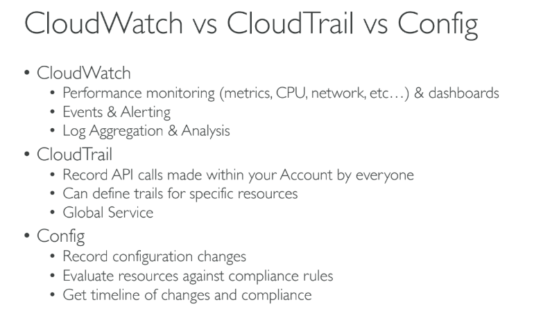
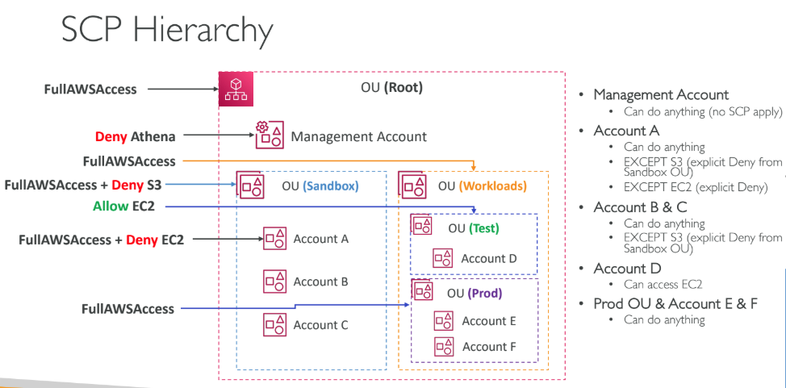

# All other misc aws services:

## cloudwatch:

- **The Instance Scheduler** on AWS solution automates the starting and stopping of Amazon Elastic Compute Cloud (Amazon EC2) and Amazon Relational Database Service (Amazon RDS) instances.

## IAM organisation:

- AWS Organizations is an account management service that enables you to consolidate multiple AWS accounts into an organization that you create and centrally manage. AWS Organizations includes account management and consolidated billing capabilities that enable you to better meet the budgetary, security, and compliance needs of your business.
- **AWS Control Tower** is a high-level service offering a straightforward way to set up and govern an AWS multi-account environment, following prescriptive best practices. AWS Control Tower orchestrates the capabilities of several other AWS services, including AWS Organizations, AWS Service Catalog, and AWS IAM Identity Center, to build a landing zone in less than an hour.
---
### Amazon Macie:
- Amazon Macie is an ML-powered security service that helps you prevent data loss by automatically discovering, classifying, and protecting sensitive data stored in **Amazon S3**. Amazon Macie uses machine learning to recognize sensitive data such as personally identifiable information (PII) or intellectual property, assigns a business value, and provides visibility into where this data is stored and how it is being used in your organization.
- Amazon Macie generates two categories of findings: policy findings and sensitive data findings. A **policy finding** is a detailed report of a potential policy violation or issue with the security or privacy of an Amazon S3 bucket. Macie generates these findings as part of its ongoing monitoring activities for your Amazon S3 data. A **sensitive data finding** is a detailed report of sensitive data in an S3 object. Macie generates these findings when it discovers sensitive data in S3 objects that you configure a sensitive data discovery job to analyze.

### Amazon Kendra:
- Amazon Kendra is just an enterprise search service that allows developers to add search capabilities to their applications. This enables their end users to discover information stored within the vast amount of content spread across their company

### Amazon Fraud Detector:
- Amazon Fraud Detector is only a fully managed service for identifying potentially fraudulent activities and for catching more online fraud faster.

### AWS Shield Advanced :
- For higher levels of protection against attacks targeting your applications running on Amazon Elastic Compute Cloud (EC2), Elastic Load Balancing(ELB), Amazon CloudFront, and Amazon Route 53 resources, you can subscribe to AWS Shield Advanced.
-  In addition to the network and transport layer protections that come with Standard, AWS Shield Advanced provides additional detection and mitigation against large and sophisticated DDoS attacks, near real-time visibility into attacks, and integration with AWS WAF, a web application firewall.
- AWS Shield Advanced also gives you 24×7 access to the AWS DDoS Response Team (DRT) and protection against DDoS related spikes in your Amazon Elastic Compute Cloud (EC2), Elastic Load Balancing(ELB), Amazon CloudFront, and Amazon Route 53 charges.

# AWS WAF:
- Even though **AWS WAF** can help you block common attack patterns to your VPC such as **SQL injection** or **cross-site scripting**, this is still not enough to withstand DDoS attacks. It is better to use AWS Shield in this scenario.
- AWS WAF is tightly integrated with Amazon CloudFront, the Application Load Balancer (ALB), Amazon API Gateway, and AWS AppSync – services that AWS customers commonly use to deliver content for their websites and applications. When you use AWS WAF on Amazon CloudFront, your rules run in all AWS Edge Locations, located around the world close to your end-users. This means security doesn’t come at the expense of performance. Blocked requests are stopped before they reach your web servers. When you use AWS WAF on regional services, such as Application Load Balancer, Amazon API Gateway, and AWS AppSync, your rules run in the region and can be used to protect Internet-facing resources as well as internal resources.

# AWS Lake Formation:
AWS Lake Formation is a service that makes it easy to set up a secure data lake in days. A data lake is a centralized, curated, and secured repository that stores all your data, both in its original form and prepared for analysis. A data lake enables you to break down data silos and combine different types of analytics to gain insights and guide better business decisions.

Amazon S3 forms the storage layer for Lake Formation. If you already use S3, you typically begin by registering existing S3 buckets that contain your data. Lake Formation creates new buckets for the data lake and imports data into them. AWS always stores this data in your account, and only you have direct access to it.
