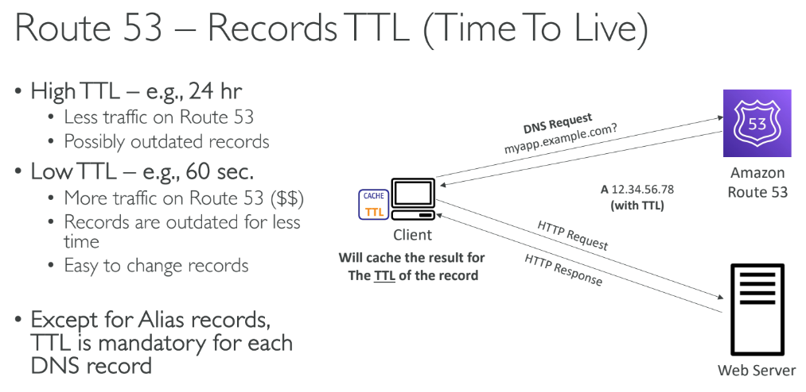
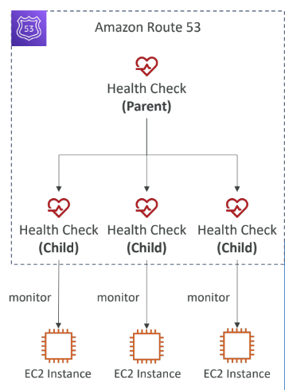
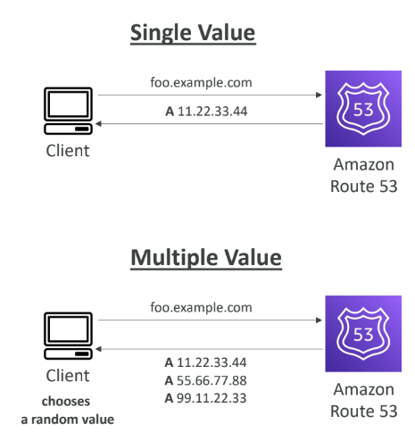
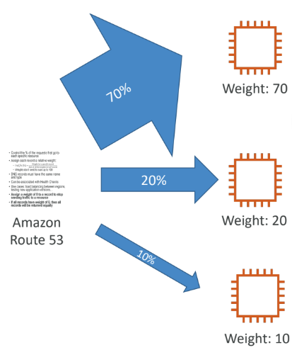
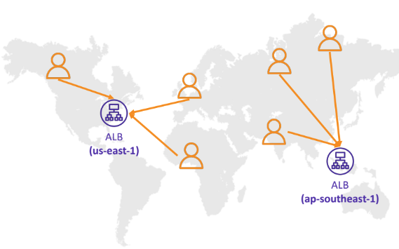
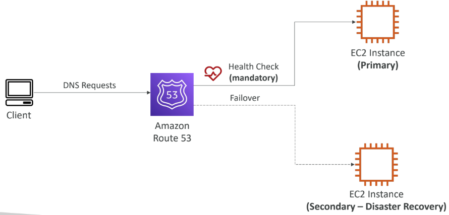
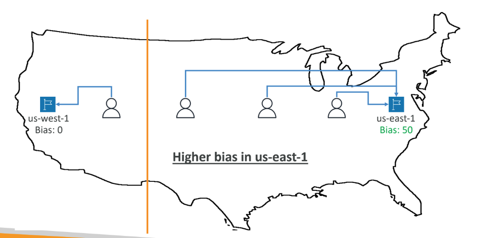
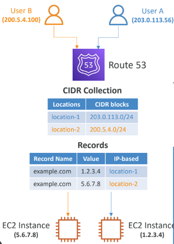
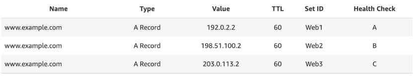

# route 53
- we can manage all dns related stuff from route 53
- this is a 100 percent available service in aws (very very rare)
- it is also a domain register(we can buy domain)
- supports all type of record: 
  - A- ipv4
  - AAAA- ipv6
  - CNAME - alias (different host name)
  - NS - name server( where we will go look up for our dns record,Directs the internet to the DNS service managing the domain)
  as well as other records like mx,etc etc
- hosted zone can be public hosted zone or private hosted zone
  - A hosted zone in DNS (Domain Name System) is a container that holds information about how traffic is routed for a specific domain (e.g., example.com) and its subdomains. It is essentially a collection of DNS records that define the domain’s configuration, including its name servers, IP address mappings, and other settings.
  - ##### Components of a Hosted Zone:
**Domain Name:** The primary domain associated with the hosted zone (e.g., example.com).
**Name Servers (NS Records):** Directs the internet to the DNS service managing the domain.
**DNS Records:** Entries that define how to route traffic (e.g., A, MX, TXT, CNAME).
**SOA Record:** (Start of Authority) Contains administrative information about the zone, like the primary name server and the domain administrator's email.
  - ##### types of hosted zone:
 private and public
###### Public Hosted Zone:
- Used for domains accessible from the internet.
- Contains DNS records such as A (IPv4), AAAA (IPv6), CNAME (alias), and others that resolve domain names to IP addresses or services.
###### Private Hosted Zone:
- Used within a specific Virtual Private Cloud (VPC).
- Configures DNS for resources that are not accessible from the internet, like internal applications or services in private networks.

----
#### TTL:
- the dns record is fetched and cached by the client or computer for ttl duration, to time to live is set to remove the cache

---
- **nslookup** command in linux or **dig** command in mac will help us to identify which ip the url is mapped into
---
###### CNAME and Alias
- alias is similar to cname record which is provided by aws. in cname you cannot route apex ie (example.com) to something else adress. it should always have something in the front(host) www.example.com, a.example.com etc etc. But this is possible with alias reciord which aws supports
- note that we cannot map alias directly to a ec2 but we can do it with lot of other stuff like lambda,elb etc etc
---
#### Route 53 – Health Checks:
- HTTP Health Checks are only for public resources
- Health Check => Automated DNS Failover
- Health Checks are integrated with CW metrics
- Combine the results of multiple Health Checks into a single Health Check
    • You can use OR, AND, or NOT
    • Can monitor up to 256 Child Health Checks
    • Specify how many of the health checks need
    to pass to make the parent pass
  
- since the route 53 is in public it is not possible to directly health check priviate endpoint.(private VPC or on-premises resource) 
- You can create a CloudWatch Metric and associate a CloudWatch Alarm, then create a Health Check that checks the alarm itself

#### Route 53 routing policy:
- simple
- weighted
- failover
- latency based
- geolocation
- multi-value answer
- geoproximity
- ##### simple:
  - when multiple ip are mapped to a dns record it just randomly picks one out of it. this is simple routing policy
  - cannot be associated with health check
  
- ##### weighted:
  - Control the % of the requests that go to each specific resource
  - Can be associated with Health Checks
   
- ##### latency based:
  - Redirect to the resource or instance that has the least latency close. we just need to mention where the instance is there along with the ip
 
- ##### Failover (Active-Passive):
  - first health check is done and if passes we will go on to send the ip to client
  - else it will go to failover endpoint
   
- ##### Geolocation:
  - latency based is we pick the nearest to a instance, but here based on user location. Specify location by Continent, Country
or by US State (if there’s overlapping,most precise location selected)
- Should create a “Default” record (incase there’s no match on location)
- example route everyone in asia to ip 192.168.0.0. if he is from asia he will be routed to this ip else he will be routed to the default ip which we give
- ##### Geoproximity:
- combination of both latency based and geolocation
- Route traffic to your resources based on the geographic location of users and resources
- Ability to shift more traffic to resources based on the defined bias
- You must use Route 53 Traffic Flow to use this feature

- ##### IP based:
- Routing is based on clients’ IP addresses.
- You provide a list of CIDRs for your clients and the corresponding endpoints/locations(user-IP-to-endpoint mappings)

- ##### Multi-Value:
-Use when routing traffic to multiple resources
- Route 53 return multiple values/resources
-  Can be associated with Health Checks (return only values for healthy resources)
- **Multi-Value is not a substitute for having an ELB**

---
#### 3rd Party Registrar with Amazon Route 53
- **step 1:** buy a domain in go daddy
- **step 2:** create a public hosted zone in route 53
- **step 3:** Update NS Records on 3rd party website to use Route 53 Name Servers
- > Domain Registrar != DNS Service. But every Domain Registrar usually comes with some DNS features
