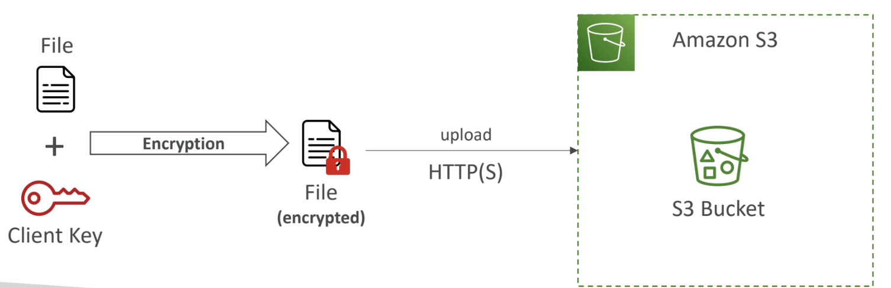

# S3
- Explicit DENY in an IAM Policy will take precedence over an S3 bucket policy.
- s3 lifecycle rules helps in moving s3 object between different tires
- we can also use s3 lifecycle rules to automate old/unfinished multipart files deletion 

## s3 event notification 
- we can trigger events when a file gets uploaded/ removed or whatever that happens in s3
- this is a very good use case example suppose we want to create thumbnail for a youtube
video, we will trigger a event to generate thumbnail once he video gets uploaded in s3

- s3 is able to access sqs,sns,lambda not through iam role but through resource policy 
- ### amazon event bridge:
  -  instead of us directly creating event notification and manually managing resouce policies we can use something called event
  bridge. which can send to 18+ services(sns,ses,lambda etc etc).
  - so s3 pushes all event to event bridge and we can set up rules, advanced filtereing, archive,
  replying event and relaiable delivery

## s3 performance:
- baseline performance: 3500 PUT/COPY/POST/DELETE, 5500 GET/HEAD
- #### multipart upload:
  - it is recommended to use mutlipart upload for files >100mb and it is a must to use multipart upload for files greater than 5 gb
- #### s3 transfer acceleration
  - increase transfer speed by transferring file to an aws edge location which will forward the data to s3 bucket
  - upload-> edge location-> s3
  - you can combine s3 transfer acceleration with multipart uploads
- #### s3 byte range fetches
  - parallize get requests by requesting spectific byte ranges. this can be used to speed up downloads
  - the same technique can be used to just fetch the partial data

# s3 batch operations:
- copy files in batch
- transfer files in batch
- encrypt files in batch
- do anything with a bunch of objects together

# s3 storage lens:
- it is a tool which Understand, analyze, and optimize storage across entire AWS organization
- Discover anomalies, identify cost efficiencies, and apply data protection best
practices across entire AWS Organization
- Aggregate data for Organization, specific accounts, regions, buckets, or prefixes
- Can be configured to export metrics daily to an S3 bucket (CSV, Parquet)

#### metrics offered by storage lens:
- ##### summary metrics:
  - identify the fastest-growing (or not used) buckets and prefixes
- ##### cost optimization metrics:
  - Provide insights to manage and optimize your storage costs with respect to s3
  - Use cases: identify buckets with incomplete multipart uploaded older than 7
days, Identify which objects could be transitioned to lower-cost storage class
- ##### data protection metrics:
  - Use cases: identify buckets that aren’t following data-protection best practices like mfa, encryption etc
- ##### Access-management Metrics:
  - Provide insights for S3 Object Ownership
  - Use cases: identify which Object Ownership settings your buckets use
- ##### Event Metrics:
  - provide insights for s3 event notification 
  - EventNotificationEnabledBucketCount (identify which buckets have S3 Event Notifications configured)
- ##### Performance metrics:
  - Provide insights for S3 Transfer Acceleration
- ##### Activity Metrics:
  - Provides insights about how your storage is requested
  - AllRequests, GetRequests, PutRequests, ListRequests, BytesDownloaded...

# object encryption:
4 ways
- server side
  1. Server-Side Encryption with Amazon S3-Managed Keys (SSE-S3)
  2. Server-Side Encryption with KMS Keys stored in AWS KMS (SSE-KMS)
  3. Server-Side Encryption with Customer-Provided Keys (SSE-C)
4. client side

## 1. Server-Side Encryption with Amazon S3-Managed Keys (SSE-S3):
- enabled by default
- use AES256 algo
- Encryption using keys handled, managed, and owned by AWS
- Must set header "x-amz-server-side-encryption": "AES256" 

## 2. Server-Side Encryption with Amazon kms (SSE-KMS):
- Encryption using keys handled and managed by AWS KMS (Key Management Service)
- Must set header "x-amz-server-side-encryption": "aws:kms"

## 3. Server-Side Encryption with Customer-Provided Keys (SSE-C):
- Server-Side Encryption using keys fully managed by the customer outside of AWS
- Amazon S3 does NOT store the encryption key you provide
- HTTPS must be used
- Encryption key must provided in HTTP headers, for every HTTP request made

## 4. Client side:
- Customer fully manages the keys and encryption cycle
- 
