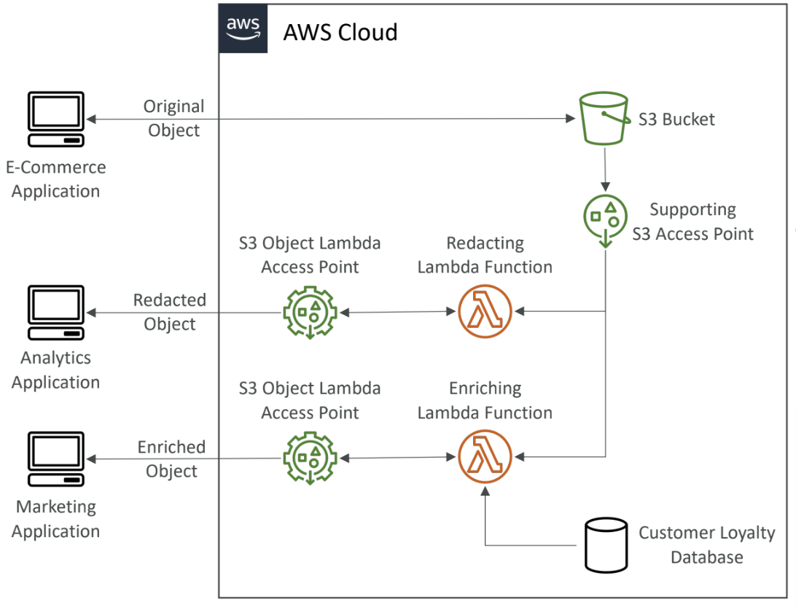

# S3
- Explicit DENY in an IAM Policy will take precedence over an S3 bucket policy.
- s3 lifecycle rules helps in moving s3 object between different tires
- we can also use s3 lifecycle rules to automate old/unfinished multipart files deletion 

## s3 event notification 
- we can trigger events when a file gets uploaded/ removed or whatever that happens in s3
- this is a very good use case example suppose we want to create thumbnail for a youtube
video, we will trigger a event to generate thumbnail once he video gets uploaded in s3

- s3 is able to access sqs,sns,lambda not through iam role but through resource policy 
- ### amazon event bridge:
  -  instead of us directly creating event notification and manually managing resouce policies we can use something called event
  bridge. which can send to 18+ services(sns,ses,lambda etc etc).
  - so s3 pushes all event to event bridge and we can set up rules, advanced filtereing, archive,
  replying event and relaiable delivery

## s3 performance:
- baseline performance: 3500 PUT/COPY/POST/DELETE, 5500 GET/HEAD
- #### multipart upload:
  - it is recommended to use mutlipart upload for files >100mb and it is a must to use multipart upload for files greater than 5 gb
- #### s3 transfer acceleration
  - increase transfer speed by transferring file to an aws edge location which will forward the data to s3 bucket
  - upload-> edge location-> s3
  - you can combine s3 transfer acceleration with multipart uploads
- #### s3 byte range fetches
  - parallize get requests by requesting spectific byte ranges. this can be used to speed up downloads
  - the same technique can be used to just fetch the partial data

# s3 batch operations:
- copy files in batch
- transfer files in batch
- encrypt files in batch
- do anything with a bunch of objects together

# s3 storage lens:
- it is a tool which Understand, analyze, and optimize storage across entire AWS organization
- Discover anomalies, identify cost efficiencies, and apply data protection best
practices across entire AWS Organization
- Aggregate data for Organization, specific accounts, regions, buckets, or prefixes
- Can be configured to export metrics daily to an S3 bucket (CSV, Parquet)

#### metrics offered by storage lens:
- ##### summary metrics:
  - identify the fastest-growing (or not used) buckets and prefixes
- ##### cost optimization metrics:
  - Provide insights to manage and optimize your storage costs with respect to s3
  - Use cases: identify buckets with incomplete multipart uploaded older than 7
days, Identify which objects could be transitioned to lower-cost storage class
- ##### data protection metrics:
  - Use cases: identify buckets that aren’t following data-protection best practices like mfa, encryption etc
- ##### Access-management Metrics:
  - Provide insights for S3 Object Ownership
  - Use cases: identify which Object Ownership settings your buckets use
- ##### Event Metrics:
  - provide insights for s3 event notification 
  - EventNotificationEnabledBucketCount (identify which buckets have S3 Event Notifications configured)
- ##### Performance metrics:
  - Provide insights for S3 Transfer Acceleration
- ##### Activity Metrics:
  - Provides insights about how your storage is requested
  - AllRequests, GetRequests, PutRequests, ListRequests, BytesDownloaded...

# object encryption:
4 ways
- server side
  1. Server-Side Encryption with Amazon S3-Managed Keys (SSE-S3)
  2. Server-Side Encryption with KMS Keys stored in AWS KMS (SSE-KMS)
  3. Server-Side Encryption with Customer-Provided Keys (SSE-C)
4. client side

## 1. Server-Side Encryption with Amazon S3-Managed Keys (SSE-S3):
- enabled by default
- use AES256 algo
- Encryption using keys handled, managed, and owned by AWS
- Must set header "x-amz-server-side-encryption": "AES256" 

## 2. Server-Side Encryption with Amazon kms (SSE-KMS):
- Encryption using keys handled and managed by AWS KMS (Key Management Service)
- Must set header "x-amz-server-side-encryption": "aws:kms"
- With SSE-KMS, the encryption happens in AWS, and the encryption keys are managed by AWS but you have full control over the rotation policy of the encryption key. Encryption keys stored in AWS.

## 3. Server-Side Encryption with Customer-Provided Keys (SSE-C):
- Server-Side Encryption using keys fully managed by the customer outside of AWS
- Amazon S3 does NOT store the encryption key you provide
- HTTPS must be used
- Encryption key must provided in HTTP headers, for every HTTP request made

## 4. Client side:
- Customer fully manages the keys and encryption cycle
- 
---
## Amazon S3 – MFA Delete:
### MFA can be enabled to:
• Permanently delete an object version
• Suspend Versioning on the bucket
### MFA won’t be required to:
• Enable Versioning
• List deleted versions
- To use MFA Delete, Versioning must be enabled on the bucket
- Only the bucket owner (root account) can enable/disable MFA Delete
---
## S3 access log
- we can store what are all the access happened in a bucket as form of logs into another bucket
- so whenever we do something on a access log enabled bucket, logs get stored in the bucket which we provide. so with that we can look at the logs and understand what actually happened
- S3 Access Logs log all the requests made to S3 buckets and Amazon Athena can then be used to run serverless analytics on top of the log files.
---
## Amazon S3 – Pre-Signed URLs
- helps in accessing/exposing private bucket data in a bucket to anybody through a url
- the url has a expiration time and the s3 resources can be accessed until that time using the presigned url
- we can Generate pre-signed URLs using the S3 Console, AWS CLI or SDK
Examples:
• Allow only logged-in users to download a premium video from your S3 bucket
• Allow an ever-changing list of users to download files by generating URLs dynamically
• Allow temporarily a user to upload a file to a precise location in your S3
bucket
---
## S3 glacier vault lock
- WORM (WRITE ONCE READ MANY)
- set up a vault lock policy
- lock the policy from future edits (forever fixed like for example policy can be never delete this glacier etc)
- best for complaince and governance

## S3 object lock
- versioning must be enabled
- Adopt a WORM (Write Once Read Many) model
- **Retention mode - Compliance:**
you cant do anything, cant edit,cant delete until retention mode gets over
- **Retention mode - Governance:**
Some users have special permissions to change the retention or delete the object. but most of them cant
- **legal hold:**
- if we put a policy called legal hold then it is there indefinitely irrespective of retention period until this policy is removed

# S3 Access point
- Access Points simplify security management for S3 Buckets
- we can access specifics from an s3 bucket by setting up an access point which has its own policies 
- Each Access Point has:
• its own DNS name (Internet Origin or VPC Origin)
• an access point policy (similar to bucket policy) – manage security at scale

---
## S3 Object Lambda
- we will set up a lambda function and do some processing on that lambda from the record fetched from s3 instead of creating a new s3 which consist of processed files, we do this process on the fly and give the user
- so s3 -> access point-> lamda function -> user

