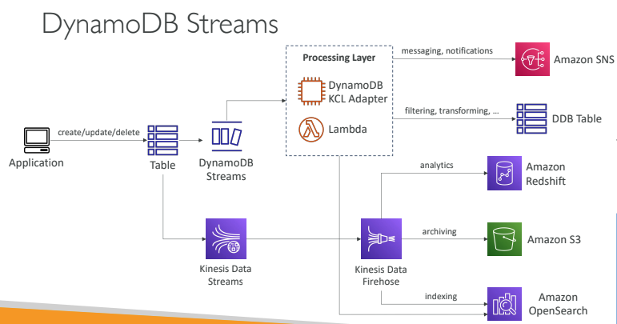

# serverless

### Lambda function:
- Lambda's maximum execution time is 15 minutes. You can run your code somewhere else such as an EC2 instance or use Amazon ECS. (minimun timeout 3 sec, maximum timeout is 15 min)

### Dynamo DB:
- DynamoDB is serverless with no servers to provision, patch, or manage and no software to install, maintain or operate. It automatically scales tables up and down to adjust for capacity and maintain performance. It provides both provisioned (specify RCU & WCU) and on-demand (pay for what you use) capacity modes.
- RCU and WCU are decoupled, so you can increase/decrease each value separately.
- The maximum size of an item in a DynamoDB table is 400kb
- ttl feature enabling will delete records once ttl is over
### DynamoDB Accelerator (DAX)

- Fully-managed, highly available, seamless in-
memory cache for DynamoDB
- Doesn’t require application logic modification
(compatible with existing DynamoDB APIs)
- different from elastic cache as it can store individual objects and can query and scan the cache

- DynamoDB Accelerator (DAX) is a fully managed, highly available, in-memory cache for DynamoDB that delivers up to 10x performance improvement. It caches the most frequently used data, thus offloading the heavy reads on hot keys off your DynamoDB table, hence preventing the "ProvisionedThroughputExceededException" exception.

### Dynamo db streams:
- DynamoDB Streams allows you to capture a time-ordered sequence of item-level modifications in a DynamoDB table. It's integrated with AWS Lambda so that you create triggers that automatically respond to events in real-time.
- DynamoDB streams operate on changes to data that has already been written to the database
- When you enable a stream on a table, DynamoDB captures information about every modification to data items in the table.
-Whenever an application creates, updates, or deletes items in the table, DynamoDB Streams writes a stream record with the primary key attribute(s) of the items that were modified. A stream record contains information about a data modification to a single item in a DynamoDB table. You can configure the stream so that the stream records capture additional information, such as the “before” and “after” images of modified items.

- Amazon DynamoDB is integrated with AWS Lambda so that you can create triggers—pieces of code that automatically respond to events in DynamoDB Streams. With triggers, you can build applications that react to data modifications in DynamoDB tables.
---

### Api gateway
- create any api endpoint and link it with whatwever you like
- deploy the api after creating and testing 
- An Edge-Optimized API Gateway is best for geographically distributed clients. API requests are routed to the nearest CloudFront Edge Location which improves latency. The API Gateway still lives in one AWS Region.
- Amazon API Gateway provides throttling at multiple levels including global and by a service call. Throttling limits can be set for standard rates and bursts. For example, API owners can set a rate limit of 1,000 requests per second for a specific method in their REST APIs, and also configure Amazon API Gateway to handle a burst of 2,000 requests per second for a few seconds.
- Amazon API Gateway tracks the number of requests per second. Any requests over the limit will receive a 429 HTTP response. The client SDKs generated by Amazon API Gateway retry calls automatically when met with this response.
---
- Lambda@Edge is a feature of CloudFront that lets you run code closer to your users, which improves performance and reduces latency.

### Amazon cognito
- Amazon Cognito can be used to federate mobile user accounts and provide them with their own IAM permissions, so they can be able to access their own personal space in the S3 bucket.
- Amazon Cognito lets you add user sign-up, sign-in, and access control to your web and mobile apps quickly and easily. Amazon Cognito scales to millions of users and supports sign-in with social identity providers, such as Apple, Facebook, Google, and Amazon, and enterprise identity providers via SAML 2.0 and OpenID Connect.
- using cognito we can generate temp credential to access s3 buckey with restricted policy as well.
