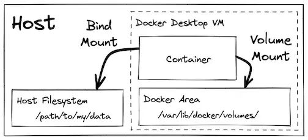
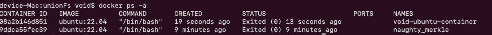
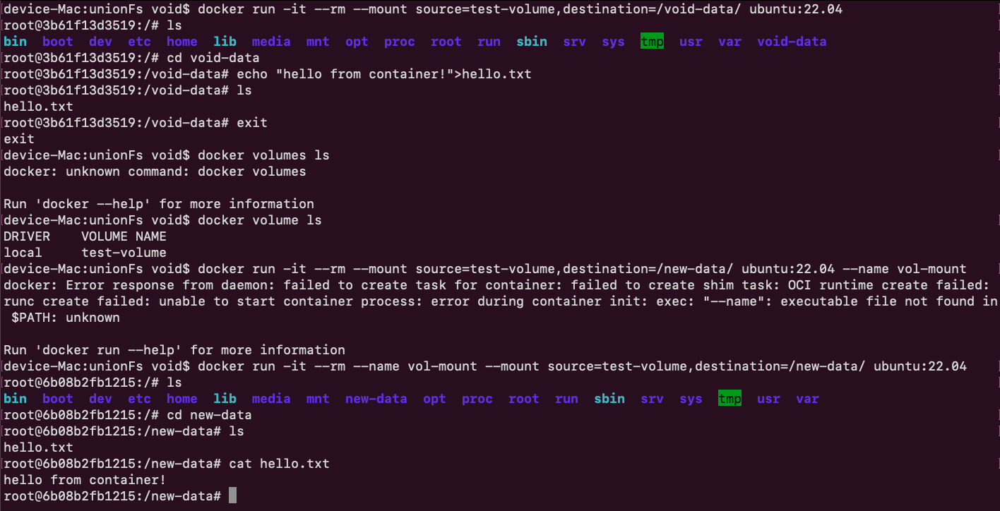

i am following through this youtube video and its corresponding written blog.
https://www.youtube.com/watch?v=RqTEHSBrYFw&t=35s
https://courses.devopsdirective.com/docker-beginner-to-pro/lessons/04-using-3rd-party-containers/01-data-persistence
- first understand virtualization and containers under the hood
- [virtualization](../os/virtualization.md)
- [containers](../os/containers.md)

## Concepts:
### Docker Container Lifecycle
A Docker container has multiple states:
- Created: The container is defined (from an image), but not running yet.
- Running: Actively executing the container’s main process.
- Exited (aka Stopped): The main process finished or crashed, and the container is no longer running.
- Removed: The container is deleted from the system — it no longer exists.
### Persisting Data Produced by the Application:
[source](https://courses.devopsdirective.com/docker-beginner-to-pro/lessons/04-using-3rd-party-containers/01-data-persistence)

- allow us to specify a location where data should persist beyond the lifecycle of a single container. 
 - The data can live in a location managed by Docker (volume mount), a location in your host filesystem (bind mount), or in memory (tmpfs mount, not pictured).
- by default docker is volume mount
 - tmpfs mount does not persist the data after the container exits, and is instead used as a temporary store for data you specifically DON'T want to persist

##  Commands:
1. run an container (which includes pulling the image if not exists)
```bash
docker run --interactive --tty --rm ubuntu:22.04
```
- ubuntu:22.04 is name:tags
- If ubuntu:22.04 is not available locally, Docker pulls it from Docker Hub 
```bash
docker pull ubuntu:22.04
```
This image consists of several read-only layers that make up the Ubuntu root filesystem.

**--interactive (-i):**
- Purpose: Keeps the container’s stdin (standard input) open even if you're not attached to it directly.
- Without -i The container runs, but you can't provide input.
- Without -i is Useful for containers that run background jobs or services.
- With -i: The container accepts input from your terminal.Required if you want to type inside the container (e.g., a shell session).
**--tty (-t):**
- gives you a proper look for interactive terminal. with -t or --tty the interactive standard input looks like a proper formatted terminal
**--rm:**
- When you type exit:
Docker stops the container
- Because of --rm, Docker automatically deletes the container and its writable layer
---
2. list all containers that are running
```bash
docker ps
```
---
3. list all containers taht are running as well as stopped or exited
```bash
docker ps -a
```

---
4. giving a name to the created container
- all containers has an unique id apart from that we can name the container
- if we are not giving our name docker gives random name to our container
```bash
docker run -it --name void-ubuntu-container ubuntu:22.04
```
---
5.  Build a container image  as base and softwares installed while building the container 
- we usually dont create the container and install the required softwares upon logging into the container. we preinstall and build
- for example we need to ping after running the ubuntu container. so we need to install ping inside ubuntu container
```bash
# Build a container image with ubuntu image as base and ping installed
docker build --tag my-ubuntu-image -<<EOF
FROM ubuntu:22.04
RUN apt update && apt install iputils-ping --yes
EOF

# Run a container based on that image
docker run -it --rm my-ubuntu-image

# Confirm that ping was pre-installed
ping google.com -c 1 # Success! 
```
- this is the right way to do
---
6. DATA MOUNT:
 a) volume mount:
- We can use volumes and mounts to safely persist the data.
mounting volume
  
 b) bind mount:
- we can mount a directory from the host system using a bind mount
```bash
# Create a container that mounts a directory from the host filesystem into the container
docker run  -it --rm --mount type=bind,source="${PWD}"/my-data,destination=/my-data ubuntu:22.04
# Again, there is a similar (but shorter) syntax using -v which accomplishes the same
docker run  -it --rm -v ${PWD}/my-data:/my-data ubuntu:22.04

echo "Hello from the container!" > /my-data/hello.txt

# You should also be able to see the hello.txt file on your host system
cat my-data/hello.txt
exit
```
- volume mount is preferred and it is the default
---
7. to list all the volumes
```bash
docker volume ls
```
---
8. go to an exited continer
```bash
docker start void-ubuntu-container
```
- Starts a container that was previously created or stopped, identified by name (void-ubuntu-container) or ID.
- It does not attach your terminal to it — it starts the container in the background.

```bash
 docker attach void-ubuntu-container
```
- Attaches your terminal to a running container’s STDIN/STDOUT/STDERR.
- You'll see output from the container and can interact if the container has a foreground process (like a shell or sleep, etc.).
- To detach safely, use Ctrl+P then Ctrl+Q.
---
