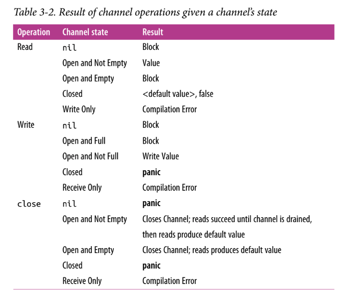

# channels
- While they can be used to synchronize access of the memory, they are best used to communicate information between goroutines.
- channels dont share memory to communicate with each other rather they communicate with each other thus it shares memory
- The disparate parts of your program don’t require knowledge of each
other, only a reference to the same place in memory where the channel resides. This can be done by passing references of channels around your program.

```go
var dataStream chan interface{}
dataStream = make(chan interface{})
```
here the channel is “of type” interface{} and we Here we instantiated the channel using the built-in make function.
- the channel initiated above is bidirectional (both send and read) but it is possible to create unidirectional channel(either send or read)
#### bi-directional channel:
- to just read only channel,we declare something like this:
```go
var dataStream <-chan interface{}
dataStream := make(<-chan interface{})
```
- to just send only channel,we declare something like this:
```go
var dataStream chan<- interface{}
dataStream := make(chan<- interface{})
```
- Go will implicitly convert bidirectional channels to unidirectional
channels when needed. if we assign a birectional channel to a unidirectional channel go takes care of it 
```go
receiveChan = dataStream
```
- **note: channels are typed** intStream := make(chan int) now this becomes a int channel
#### sending and receiving data in channel:

```go
stringStream := make(chan string)
go func() {
stringStream <- "Hello channels!" --------- // send value to a channel
}()
fmt.Println(<-stringStream) -------------- // read or receive the sent value in the ctx
```
 - note:
 >it is an error to try and write a value onto a read-only
channel, and an error to read a value from a write-only channel. 
#### Blocking:
- any goroutine that attempts to write to a channel that is full will wait until the channel has been emptied, and any goroutine that attempts to read from a channel that is
empty will wait until at least one item is placed on it.
#### Closed channel:
```go
stringStream := make(chan string)
go func() {
stringStream <- "Hello channels!"
}()
salutation, ok := <-stringStream
fmt.Printf("(%v): %v", ok, salutation)
```
op: (true): Hello channels!

- reading from a channel gives 2 paramenters and the second parameter indicates if the channel has been closed or not
- we can still infinitely read from closed channel but cant send anything
- In programs, it’s very useful to be able to indicate that no more values will be sent over a channel. This helps downstream processes know when to move on, exit, reopen communications on a new or different channel, etc.
- “Hey, upstream isn’t going to be writing any more values, we will close the channel to indicate others that no more value will come"
```go 
valueStream := make(chan interface{})
close(valueStream)
```
- this properly helps to **range** over the channel
- The range keyword—used in conjunction with the for statement—supports channels as arguments, and will automatically break the loop when a channel is closed. This allows for concise iteration over the values on a channel.
```go
intStream := make(chan int)
go func() {
defer close(intStream)
for i := 1; i <= 5; i++ {
intStream <- i
}
}()
for integer := range intStream {
fmt.Printf("%v ", integer)
}
```
op:1 2 3 4 5

- Closing a channel is also one of the ways you can signal multiple goroutines simultaneously. If you have n goroutines waiting on a single channel, instead of writing n times to the channel to unblock each goroutine, you can simply close the channel.
Since a closed channel can be read from an infinite number of times, it doesn’t matter how many goroutines are waiting on it, and closing the channel is both cheaper and faster than performing n writes.

```go
begin := make(chan interface{})
var wg sync.WaitGroup
for i := 0; i < 5; i++ {
wg.Add(1)
go func(i int) {
defer wg.Done()
<-begin  ----------------//all 5 go routine has started but blocked since it waits for some value
fmt.Printf("%v has begun\n", i)
}(i)
}
fmt.Println("Unblocking goroutines...")
close(begin) -------------------- // the moment we close the begin will come to know that the channel has been closed.  thus unblocking all the goroutines simultaneously.
wg.Wait()
```
op: Unblocking goroutines...
4 has begun
2 has begun
3 has begun
0 has begun
1 has begun

#### Buffered Channel:
- there is a fixed size buffer for the channel. atmax the channel can hold n number of data and any new data can be sent in a full buffer only when we remove value from the buffer
```go
c := make(chan rune, 4)
c <- 'A'
c <- 'B'
c <- 'C'
c <- 'D'
// After four writes, our buffered channel with a capacity of four is full. What happens if we attempt to write to the channel again?
c <- 'E'
// The goroutine performing this write is blocked! The goroutine will remain blocked until room is made in the buffer by some goroutine performing a read.
<-c
// As you can see, the read receives the first rune that was placed on the channel, A, the write that was blocked becomes unblocked, and E is placed on the end of the buffer.
```
Now that you understand the how and why of performing operations on channels, let’s create a handy reference for what the defined behavior of working with channels is.


