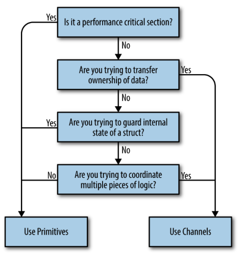

# Communicating Sequencial Processes (CSP)

## What is the difference between concurrency and parallelism?
- concurrency and parallelism are not the same
 >Concurrency is a property of the code; parallelism is a property of the running
program.
 - Well, let’s think about that for second. If I write my code with the intent that two
chunks of the program will run in parallel, do I have any guarantee that will actually
happen when the program is run? What happens if I run the code on a machine with
only one core? Some of you may be thinking, It will run in parallel, but this isn’t true!
The chunks of our program may appear to be running in parallel, but really they’re
executing in a sequential manner faster than is distinguishable. The CPU context
switches to share time between different programs, and over a coarse enough granularity of time, the tasks appear to be running in parallel. If we were to run the same
binary on a machine with two cores, the program’s chunks might actually be running
in parallel.
- This reveals a few interesting and important things. **The first is that we do not write
parallel code, only concurrent code that we hope will be run in parallel.**

---

## What is CSP:
- CSP stands for **Communicating Sequential Processes**, which is both a technique and
the name of the paper that introduced it. In 1978, Charles Antony Richard Hoare
published the paper in the Association for Computing Machinery
-  GO's concurrancy is very much inspired from this CSP paper. 
- Hoare introduced ! for sending input to a process and ? for reading output from a process. Each command required specifying either an output variable (for reading) or a destination (for sending). If both referred to the same entity, the processes were said to correspond. This concept is similar to Go's channels.
## What are all the things that GO has inspired from CSP:
1. Golang provides channels (communication inputs and outputs between processes), goroutines (processes) and the select statement.
2. Channels:
	1. We can easily communicate between different goroutines.
	2. There is less need to do memory access synchronisations(mutexes as mutexes are painful).Mutexes are primarily used for protecting shared resources, ensuring that only one thread accesses a resource at a time.
Coordinating multiple mutexes across subsystems can lead to complex and error-prone designs, such as deadlocks or contention, making the system harder to write and debug.
	3. Allows us to compose the outputs and inputs to other subsystems, and combine it with timeouts or cancellations.Channels allow for sophisticated coordination mechanisms. You can integrate timeouts, so the system knows when to stop waiting for input. You can handle cancellations, allowing parts of the system to abort processes gracefully. You can send messages to notify other subsystems about events or changes.
 

3. Goroutines:
	1. Are very lightweight, we don't have to worry about creating one (unlike Java threads for instance)
	2. We don't need to think about parallelism in our code, and allows us to model problems closer to their natural level of concurrency.
	3. Are multiplexed onto OS Threads automatically and scheduled for us (Go does that). We don't have to worry about these optimisations.
	4. Go scales all our gouroutines dynamically, we don't have to worry about specific OS/hardware limit, because it does it for us.
4. Select:
	1. Complement to channels
	2. enables all the difficult bits of composing channels. Waits for events, selects messages from competing channels, continue if there are no messages waiting...

--- 
## Go’s Philosophy on Concurrency
- Go's design heavily incorporates Communicating Sequential Processes (CSP), but it also supports traditional concurrency methods like memory access synchronization(mutex). The sync package provides primitives such as locks, resource pools, and tools to manage goroutines. This dual approach allows developers to choose between CSP-style concurrency using channels or traditional synchronization methods, depending on the problem.
- > One of Go’s mottos is “Share memory by communicating, don’t communicate by sharing memory.”
That said, Go does provide traditional locking mechanisms in the sync package. Most
locking issues can be solved using either channels or traditional locks.
So which should you use?
Use whichever is most expressive and/or most simple.
- ### But how will you ideatify what to use (primitive style or cps style)?
  - it can be identified with this decision tree:
  
  - #### Are you trying to transfer ownership of data?:
    - **Understanding Data Ownership and Channels in Concurrent Programming:**
      ##### 1. Transferring Ownership of Data:
        - When one part of your program produces some data and needs to give it to another part:  
        - Think of it like *"passing ownership"* of that data.  
        - **Why ownership matters:** If two parts of your program can change the same data at the same time, it can cause errors (like corruption or bugs). To avoid this, we ensure only one part "owns" the data at any time.
      ##### 2. Memory Ownership in Non-Garbage Collected Languages :
        - In programming languages without garbage collection (e.g., C, Rust): 
          - You explicitly manage who owns a piece of memory (or data).
          - Only the owner can modify or release it. This prevents two pieces of code from messing with the same memory at once.  
        - This concept applies to concurrent programming too—ownership ensures safety in multi-threaded programs.

      ##### 3. How Channels Help:  
        Channels solve this ownership problem in a structured way:  
        - When you send data through a **channel**, it’s like saying:  
          > *"I’m done with this data. Now you take over."*  
        - The channel enforces that **only one part of your program (producer or consumer)** owns the data at any time.  
        - The **channel’s type** tells you exactly what kind of data it transfers, making your intent clear.

      ##### 4. Benefits of Using Channels:
        - **Buffered Channels = In-Memory Queue**  
          - A **buffered channel** can temporarily hold data until the consumer is ready to process it.  
          - This "queue-like behavior" lets the producer and consumer work independently without waiting for each other.  
          - **Example:** A producer can keep adding tasks while a consumer processes them one by one at its own pace.

      ##### 5. **Composable Code** 
        -  When you use channels, your code becomes easier to connect with other concurrent systems.  
        - For instance, you can easily combine multiple producers or add timeouts and cancellations.
      ##### In Simple Terms
        - Think of a channel as a **conveyor belt**:  
          - A **producer** puts data on the belt. The moment they do, they no longer "own" it.  
          - The **consumer** takes data off the belt. Now they own it and can use it.  

This ensures that only one party (producer or consumer) is working with the data at any moment, avoiding conflicts and errors.  

Channels make it easy to pass data around safely while keeping your code clean and modular.

  - #### Are you trying to guard internal state of a struct?
    - its better to use memory access synchronization primitives (like sync.Mutex) rather than channels in concurrent programming, particularly for guarding internal state within a data structure.
    - Channels are for communication between goroutines (e.g., passing data or coordinating actions).
    - But here, you don’t need to communicate; you just need to protect the internal state of your struct from being modified by multiple goroutines at the same time.
    - A mutex (short for "mutual exclusion") ensures that only one goroutine can access the critical section of code (the part that modifies the state) at any time so that the data remains atomic
    - If you’re passing locks around or requiring other parts of your program to manage them, it’s a sign your design might be flawed.
    - Always Keep locks local to a type or a small scope.
    ##### In simple terms
      - Think of a mutex as a key that locks a room.
        - Only one person (goroutine) can enter the room (critical section) at a time.
        - When they leave, they unlock the room so someone else can enter.
      This ensures that no two people can make changes in the room at the same time, keeping everything safe and orderly.
  - #### Are you trying to coordinate multiple pieces of logic?
    - In this case,channels are better
    - Channels in Go are inherently more composable than traditional synchronization primitives like locks. While having locks scattered throughout your code can lead to complexity and bugs, channels are designed to integrate seamlessly into your program and are encouraged for managing concurrency. 
    - Using channels can simplify the management of emergent complexity in your software. Features like Go’s select statement make it easier to handle multiple channels, while channels themselves can act as queues and be safely passed around. 
    - If you’re struggling with issues like deadlocks or race conditions in your code and are relying on synchronization primitives, it’s often a sign to switch to channels for a clearer and more manageable solution.
  - #### Is it a performance critical session
    - When dealing with performance-critical sections of your code, it’s important to avoid the mindset of defaulting to mutexes simply because you want your program to be performant.
    - This is because channels themselves rely on memory access synchronization internally, so they might be inherently slower for such scenarios. However, before resorting to these primitives, consider whether the bottleneck suggests the need to restructure your program. Often, revisiting the design can lead to better long-term solutions without sacrificing clarity or maintainability.
  - > Go’s philosophy on concurrency can be summed up like this: aim for simplicity, use
channels when possible, and treat goroutines like a free resource.
 ---
