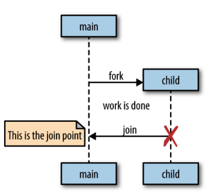

# Goroutines
- go routine is a concurrency primitive. Goroutines are Go’s concurrency mechanism for running code concurrently (at the same time as other code) in a lightweight and efficient way.
- every Go program has at least one goroutine: the **main goroutine**, which is automatically created
and started when the process begins.
- we just need to add the keyword **go** in front of the func to evoke go routine
 ```go
 func main() {
go sayHello()
// continue doing other things
}
func sayHello() {
fmt.Println("hello")
}
 ```
- we can also evoke anonomous function using go routine
```go
go func(){
  fmt.Println("hiiii")
}
```
or assign the value of the annonomous function and can be called with a go routine
```go
sayHello := func() {
fmt.Println("hello")
}
go sayHello()
// continue doing other things
```
## how do goroutines actually work?

  - The Go runtime uses a small number of OS threads and schedules many goroutines on them

 - ### What are goroutines:
  - Goroutines are Go’s concurrency mechanism for running code concurrently (at the same time as other code) in a lightweight and efficient way.
  - They are not OS threads: Unlike threads managed by the operating system, goroutines are managed by the Go runtime, making them faster and using less memory.
  - They are not exactly green threads, but they share similarities. Green threads are threads managed by the language runtime instead of the OS.
  - ###  Goroutines as Coroutines:
    - Goroutines are a type of **coroutine**:
      - A coroutine is a function or method that can pause and resume its execution at certain points.
      - Coroutines are nonpreemptive, meaning they cannot be interrupted arbitrarily (e.g., by the OS). Instead, the code itself decides when it can pause.
      - Coroutines use specific points in the code (called yield points) to temporarily suspend execution and later reenter to continue from where they left off.
  - ### What Makes Goroutines Unique?
    - **Integration with Go’s Runtime:** What sets goroutines apart is their deep integration with Go’s runtime. Instead of manually defining suspension points, Go’s runtime monitors the goroutine’s behavior. It automatically suspends a goroutine when it’s waiting for input/output (blocked) and resumes it when it’s ready to continue. This integration allows for an efficient management of concurrency.
    this is the reason why go routines are not exactly green threads.
    - **Preemptability:** Although goroutines are managed in a way that they can be preempted (paused) at blocking points, they are not forcibly interrupted like traditional OS threads. This makes them efficient in terms of resource usage.
  - ### Concurrency and Coroutines:
    - Concurrency is a fundamental concept in programming that allows multiple tasks or computations to run simultaneously. In the context of Go and goroutines, concurrency is not just a property of a single goroutine; it requires a host that can manage multiple goroutines simultaneously. 
    - Goroutines in Go are **inherently concurrent** because they allow multiple subroutines (like functions, closures, or methods) to execute concurrently. This means that multiple goroutines can run simultaneously, each potentially performing different tasks or computations.
    - **concurrency is not a property of a single goroutine**. A goroutine(coroutine) is essentially a lightweight thread of execution. For it to be truly concurrent, it needs to be managed alongside other goroutines. In other words, concurrency emerges when multiple goroutines are scheduled, managed, and allowed to run concurrently by the runtime system. since it is a coroutine we need to add the breaking points into it which is done by the runtime system Host.
    - To coordinate the execution of multiple goroutines, Go relies on its runtime system as the host. The runtime is responsible for scheduling goroutines to ensure they run concurrently on available operating system threads. The runtime handles tasks like pausing and resuming goroutines when necessary (e.g., when they are blocked on I/O operations or synchronization primitives like mutexes).
    - >concurrency is a way of writing code in a hope that it runs parallel(execution time of different entities overlap or runtogether). But it doesnt mean that it will always run parallel because parallelism depends on the multiple cores that are available. if there is just 1 core then we do some gimmics to show that everything runs parallel but in that case eventually you can see that its been running sequentially
    - Parallelism, on the other hand, is about performing multiple tasks at the same time using multiple processors or cores. In Go, concurrency is often achieved through multiple goroutines running on a single core or multiple cores, but not all of them are guaranteed to run in parallel.
    - #### Scheduling:
      - The Go runtime manages the lifecycle of goroutines. It schedules them onto OS threads (green threads) in such a way that when one is blocked (waiting for a resource), another can take its place. This dynamic scheduling ensures efficient use of resources, like CPU cores and memory, and allows the program to continue making progress even if some goroutines are temporarily idle.
      - **M:N scheduler** used by Go, which maps several goroutines (M) to a smaller number of OS threads (N) When there are more goroutines than threads, the scheduler handles their distribution else run time handles the scheduling. It ensures that when a goroutine becomes blocked (waiting for data, I/O, etc.), other goroutines can run in its place. This makes efficient use of system resources and keeps the application responsive.
      - When a goroutine is blocked, the runtime automatically suspends it. Once it’s unblocked (e.g., after receiving data or completing an I/O operation), the runtime resumes it. This automatic management is an elegant partnership between the runtime and the goroutine’s logic.
      - #### Runtime:
        - The runtime is an essential part of the Go programming environment that manages goroutines and their interactions. It abstracts away much of the complexity of concurrency, such as thread management, scheduling, garbage collection, and memory allocation. The runtime is responsible for creating and destroying goroutines, scheduling them to run on available operating system threads, and handling synchronization between them.
        - ##### Responsibility:
          - **Goroutine Management:** The runtime creates and destroys goroutines as needed. When a new goroutine is launched, the runtime sets it up and allocates a stack for it to run. When a goroutine finishes, the runtime cleans up its resources.
          - **Scheduling:** The runtime decides when and where each goroutine should run. It schedules goroutines onto OS threads (often referred to as green threads or logical threads). If there are more goroutines than threads, the runtime uses an M:N scheduler to manage the distribution.
          - **Blocking and Resuming:** When a goroutine is blocked (waiting for I/O, data, or another synchronization event), the runtime automatically suspends it. This means that the operating system thread assigned to the goroutine is made available for other goroutines that need to run. When the blocking condition is resolved, the runtime resumes the goroutine, ensuring it continues where it left off.
    - Understanding the role of the runtime and scheduler in Go’s concurrency model is crucial for writing efficient and responsive applications. The runtime abstracts away much of the complexity involved in managing goroutines, and the scheduler ensures that these goroutines are distributed efficiently across the system’s resources. This makes Go particularly well-suited for building concurrent applications where multiple tasks need to be handled simultaneously without manual intervention.
  - ### Memory Management:
    - Each goroutine gets its own stack, but they share the memory space of global variables and heap-allocated objects. The Go runtime provides garbage collection, which manages memory efficiently and automatically cleans up unused objects, preventing memory leaks.
    - When a goroutine completes its task or goes out of scope, its stack and any other resources are freed automatically by the runtime.
    - > the garbage collector does nothing to collect goroutines that have been abandoned somehow.
## Folk Join model:
  
  - from main the routine fork out and run parallel to main and later if it executes before main, it joins back to main at the join point. this is called folk join model 
  - In the example below we wont be sure that the output will be hello,the routine scheduling will  be done by the runtime but the main might have run before the routine and exiting out. so here we did folk but we may or may not join
  ```go
        sayHello := func() {
      fmt.Println("hello")
      }
      go sayHello()
      // continue doing other things
  ```
  - this can be solved my many methods like sleeping until we get a join point or using traditional way of creating waitgroup
  ```go
      var wg sync.WaitGroup
      sayHello := func() {
      defer wg.Done()
      fmt.Println("hello")
      }
      wg.Add(1)
      go sayHello()
      wg.Wait()
  ```
  now we wait until wg is done thus it we get a join point and it prints hello for sure.
- > NOTE: that goroutines execute within the same address space they
were created in, so we can access values outside the address space but caution that we need to sync data (use mutex or something) to maintail data atomicity
```go
      var wg sync.WaitGroup
      salutation := "hello"
      wg.Add(1)
      go func() {
      defer wg.Done()
      salutation = "welcome"
      }()
      wg.Wait()
      fmt.Println(salutation)
```
