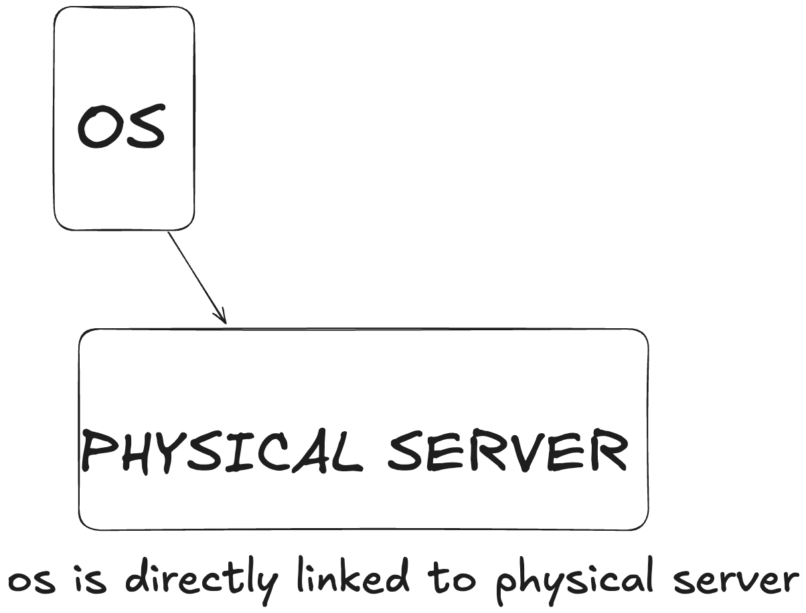

## what is virtualization?
goated video: https://www.youtube.com/watch?v=zLJbP6vBk2M
- Virtualization is the process of creating a virtual (rather than physical) version of something, such as a server, storage device, network resource, or operating system. 
- Virtualization lets you share the hardware resources of the underlying physical server to be consumed by virtual servers running on it.
- we sepearate the os out of the physical hardware so that they can  move around

## Evolution of Virtualization:
### 1.bare metal:

- simple and easy way. only way before virtualization
- bare metal is installing everything directly on our physical server
- With a bare metal system, the operating system, binaries/libraries, and applications are installed and run directly onto the physical hardware.
- this can lead to some problems like:
  - dependency hell: assume 2 application runs in the same machine and both needs golang but different version. this will create a problem in setting up and lot of configuration needs to be changed to make both the application work.
  - Low utilization efficiency
  - Large blast radius: if something failed all the application will crash
  - Slow start up & shut down speed (minutes): beacause we need to setup all the application
  - Very slow provisioning & decommissioning: because of all these complexity it takes time to provision and deprovision

### 2.virtualization

- if we wanna move to a new physical server, we need to set up the same old hypervisor and that all we can copy the os in quickly in minutes unlike bare metal where everything needs to be setup from scratch based on the new physical hardware
- here we can run mulitple instances of different os on top of the hypervisor. 
- example if we wanna run a windows program in mac, i will install a hypervisor virutual box and install windows as one instance and run (type 2)

### types of hypervisor
- type 1 
- type 2

### type1 hypervisor:

- A Type 1 hypervisor, also known as a bare-metal hypervisor, is a virtualization layer that runs directly on the physical hardware of the host machine without an underlying operating system.
- Runs directly on hardware: No OS in between.
- Examples
  - VMware ESXi
  - Microsoft Hyper-V (in server mode)
  - Xen (Citrix Hypervisor)
  - KVM (Linux-based, sometimes debated but generally considered Type 1 due to kernel integration)
- when you log into a type1 hv unlike type2 since there is no os you have very few details in them like just the ip address of hypervisor. so things are manages with the help of another machine with management software through which you connect to the hypervisor with the ip and manage the server

- for example we pay for VMware ESXi software which installs hv in physical servers and they earn money in giving additional features while management console like moving os instances between hypervisors, move to free rack when an instance have heavy load etc etc
#### overprovisioning hypervisors
- note that we can overprovisioned hypervisors which is recommended
- An overprovisioned hypervisor refers to a situation where a hypervisor is configured to allocate more virtual resources to its VMs than the physical hardware actually has usually in terms of CPU, RAM, or storage.
- this is under the assumption that not all VMs will fully utilize their assigned resources at the same time.
eg:
You have a physical server with:
8 physical CPU cores
32 GB RAM
VM Name	vCPUs Assigned	RAM Assigned
WebServer1	4 vCPUs	8 GB	
WebServer2	4 vCPUs	8 GB	
DBServer	6 vCPUs	12 GB
AppServer	4 vCPUs	8 GB
otal Virtual Resources Assigned
vCPUs: 4 + 4 + 6 + 4 = 18 vCPUs
RAM: 8 + 8 + 12 + 8 = 36 GB
eventhough we over provisioned it is immposible to allocate more than what it has.because of this over provisioning, suppose db server load increases, it can use upto 12GB thus it can pull off ram from other places to maintain. 
note that this will create a problem if everything tries to exceed 
### type2 hypervisor:
- A Type 2 hypervisor, also known as a hosted hypervisor, is virtualization software that runs on top of a host operating system (OS) like Windows, macOS, or Linux. It relies on the host OS to access hardware resources such as CPU, memory, and disk.
- Think of it as "an app that creates and manages virtual machines inside your regular OS."
- install a os, install a hypervizor in top of os and multiple instance of os 
- eg: if we wanna run a windows program in mac, i will install a hypervisor virutual box and install windows as one instance and run 

**cons:**
- Slower than Type 1 due to extra OS layer.
- Host OS + hypervisor + guest OS = more RAM/CPU usage.
- Vulnerable if host OS is compromised.
### 3.containers
vms vs container: https://www.youtube.com/watch?v=eyNBf1sqdBQ

#### disadvantages in vms:
- too heavy coz multiple os been installed
- drinks lot of ram because of the same reason of multiple os
- takes time to set up (minutes) the application because of the same reason (os need to boot up and then application needs to boot up)
- these can be solved by containers
- containers packs all the application run requirements into a container and runs on os
- Containers virtualize at the OS level, not the hardware level. Instead of spinning up an entire guest OS, containers share the host kernel but isolate user space.
- A container is a lightweight, standalone, executable package that includes: 
  - our application
  - Its dependencies
  - Environment variables
  - System tools and libraries
- But it shares the host OS kernel instead of using its own, unlike VMs.

| **Feature**        | **Container**                                 | **Virtual Machine**                          |
|--------------------|-----------------------------------------------|----------------------------------------------|
| **Boot Time**      | Milliseconds                                  | Seconds to minutes                           |
| **Overhead**       | Very low                                      | High (full OS per VM)                        |
| **Kernel Usage**   | Shares host kernel                            | Separate kernel for each VM                  |
| **Isolation**      | OS-level (namespaces, cgroups)                | Hardware-level (hypervisor)                  |
| **Portability**    | High (consistent across platforms)            | Medium (depends on VM config)                |
| **Security**       | Moderate (depends on kernel isolation)        | High (strong isolation)                      |
| **Ideal Use Case** | Microservices, dev/test, CI/CD                | Legacy apps, OS testing, monoliths           |

Sure — let’s break down the **core components of containers**. These are the building blocks that make containers work efficiently and portably.

---

##  Core Container Components

| **Component**     | **Description**                                                                 |
|-------------------|---------------------------------------------------------------------------------|
| **Image**         | A snapshot of the application and its dependencies (read-only).                 |
| **Container**     | A running instance of an image (read-write layer on top of image).              |
| **buildScript**    | A script that defines how to build a container image(Docker file).                           |
| **Container Engine** | Manages images, containers, networks, volumes (e.g., Docker, containerd).    |
| **Runtime**       | The low-level tool that creates and runs containers (e.g., `runc`).             |
| **Registry**      | A service to store and distribute container images (e.g., Docker Hub, GHCR).    |
| **Volumes**       | Persistent storage for containers (data survives container restarts).           |
| **Networks**      | Isolated virtual networks connecting containers (bridge, host, overlay, etc.).  |

- disadvantage of container are all application shares the same os. so if os fails everything crashes and very application uses the same os since os layer is common. which can be an disadvantage if you want os level isolation
