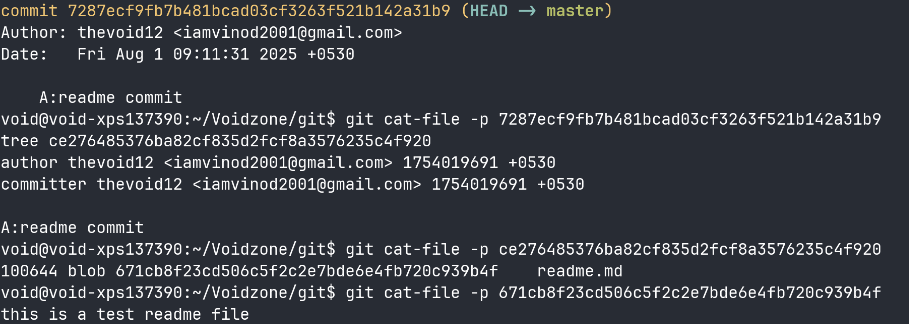
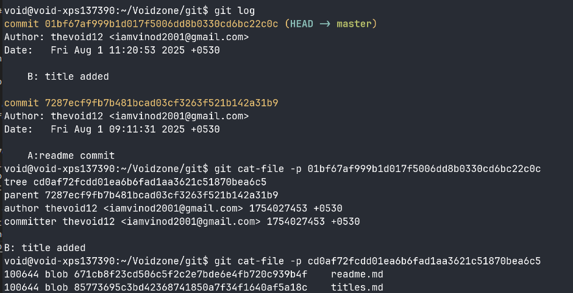
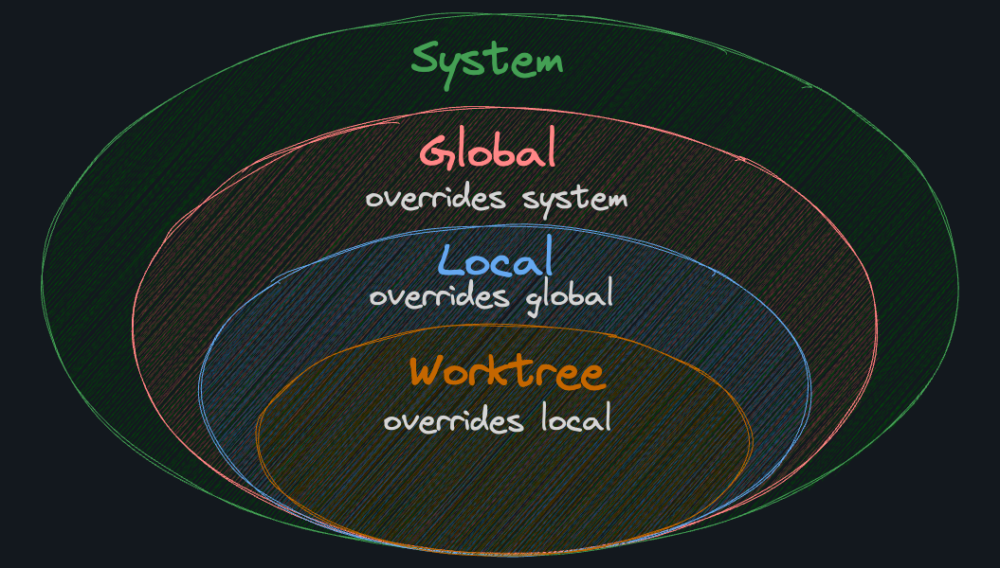
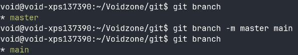
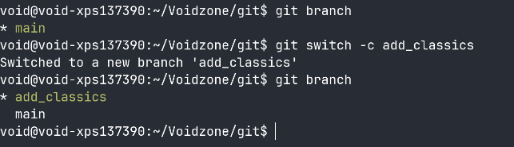
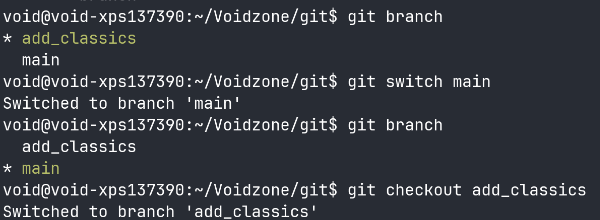
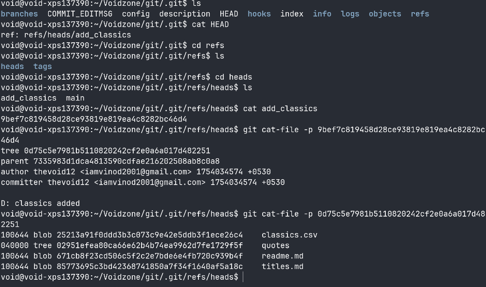
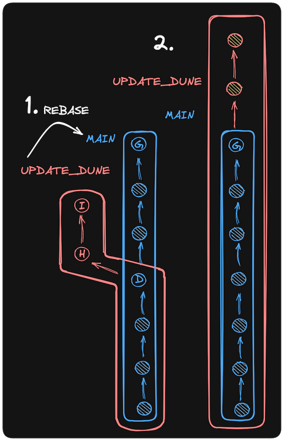

# my git sheet

## basics
- git is a version control system
- file can be any of the 3 states
  - untracked: Not being tracked by Git
  - staged: Marked for inclusion in the next commit
  - committed: Saved to the repository's history
- we can check the status of the file using
  ```bash
    git status
  ```
- when you create a file it is untracked by default. Without staging, no files are included in the commit—only the files you explicitly git add will be committed. only the files that are staged will be included to be committed
- we stage using add command
  ```bash
    git add <path-to-file | pattern> 
    git add readme.md
  ```
- A commit is a snapshot of the repository at a given point in time. It's a way to save the state of the repository, and it's how Git keeps track of changes to the project. A commit comes with a message that describes the changes made in the commit.
  ```bash
  git commit -m "your message here"
  ```
- A Git repo is a (potentially very long) list of commits, where each commit represents the full state of the repository at a given point in time.
The git log command shows a history of the commits in a repository. This is what makes Git a version control system. You can see:
    - Who made a commit
    - When the commit was made
    - What was changed 
    ```bash
    git log 
    git log -n 10 #get last 10 commit history
    git log --oneline #shows a shorter version of it just to see where we are
    git log --graph
    git log --graph --oneline #gives the commit detail and msg in one line
    git log --oneline --graph --all #all will show log from all the branches else git log will only show logs of the branch which we are currently in
    git log --oneline --decorate --graph --parents #this is the best possible one. decorate will give branch and tag info, parents will have the parent's hash so that it is easy to visuvalize
    ```
    - with out --all Only shows the commits reachable from your current HEAD (usually your current branch). Doesn’t include: Commits in other branches unless they’re ancestors of your current branch, Unmerged branches, Tags not pointing to the current history, Remote tracking branches 
    ---

## internals
- So the commit stores all of these in 1 inode:

   - A pointer to a directory tree

    - Pointers to parent commits

    - Metadata (author, time, message)

- to see the content of the commit using commit hash
  ```bash
    git cat-file -p <hash> # -p is for pretty print
  ```
- the other way to do is to go to cd /.git/objects/(we will have the actual object which is referenced everywhere)
  op:
  ```bash
    tree ce276485376ba82cf835d2fcf8a3576235c4f920
    author thevoid12 <iamvinod2001@gmail.com> 1754019691 +0530
    committer thevoid12 <iamvinod2001@gmail.com> 1754019691 +0530
    A:readme commit
    ```
- tree maintains the directory and file structure of files added. so you need to traverse through the tree to take a look into the subtree(if has subdirectory) or blob
- and blob inside the tree is the content, it has its own hash and cat-file that hash to see the content in the file
- Git reuses unchanged blobs and trees by hash. It does not duplicate 

- here I committed another file. so the other file will have a new tree with 2 commit hashes since file A isnt changed we have the same reference to the object hash at ./.git/objects/<hash>


- notice that the hash of readme.md is same so we are just referencing the old file not creating again and again preventing chance of inode burst
- eg:
Let’s say only titles.md was added in the second commit and quotes/ was added in the third.

| Commit | What Changed    | What Git Does                                                      |
| ------ | --------------- | ------------------------------------------------------------------ |
| A      | readme.md       | Adds 1 blob, 1 tree, 1 commit                                      |
| B      | titles.md added | Adds 1 blob, new root tree, 1 commit (reuses readme blob)          |
| C      | `quotes/` added | Adds 2 blobs, 1 nested tree, new root tree, 1 commit (reuses rest) |

```sql
Commit C
└── tree (root)
    ├── blob: readme.md
    ├── blob: titles.md
    └── tree: quotes/
        ├── blob: dune.md
        └── blob: startwars.md

Commit B
└── tree (root)
    ├── blob: readme.md
    └── blob: titles.md

Commit A
└── tree (root)
    └── blob: readme.md
```
---
## config
- we can configure who is the user who is committing with his email in different spaces. either globally or locally. so when you check the commit you will get to know who is the committed user. this user detail is configurable per peroject level( locally) or globally (per user level)
- global is very common and 99% of the time we use this. 1% we might need to configure locally 
 ```bash
git config --add --global user.name "void"
git config --add --global user.email "void@gmail.com"
```
- There are several locations where Git can be configured. From more general to more specific, they are:

    - system: /etc/gitconfig, a file that configures Git for all users on the system
    - global: ~/.gitconfig, a file that configures Git for all projects of a user
    - local: .git/config, a file that configures Git for a specific project
    - worktree: .git/config.worktree, a file that configures Git for part of a project


---
## branches
- under the hood a branch is just a named pointer to a specific commit. When you create a branch, you are creating a new pointer to a specific commit. The commit that the branch points to is called the tip of the branch.
- Because a branch is just a pointer to a commit, they're lightweight and "cheap" resource-wise to create. When you create 10 branches, you're not creating 10 copies of your project on your hard drive.
- **branch tip** is the latest commit of that branch. you can trace back from the branch tip to whereveer we want to 
- to check which branch I am currentky on
  ```bash
  git branch
  ```
- we will be by default at the master branch(root). github (where we store our code) has recently changed the default branch name from master to main. so since I use github i will rename my master aka trunk to main
- to rename a branch
    ```bash
    git branch -m master main
    ```
    
- we can always change the global config to name the default branch name as main instead of master. Change the init.defaultBranch key to main.
- there are two ways to create new branch 
    1. create branch first, then switch to the branch (2 command)
        ```bash
        git branch my_new_branch
        ```
    2. directly create and switch to the branch at the same time (1 command)
        ```bash
        git switch -c my_new_branch # -c creates the new branch if not exists
        ```
    
- if we want to create branch from some random node.  
```bash
git switch -c branch_name COMMITHASH # commit hash is the hash of the node from which we need to create a branch
``` 
- we can switch branch using git switch (newer command) or git checkout (older command)
  ```bash
    git switch branch1
    # or, the old way:
    git checkout branch1
    ```
    
- The references of "heads" (or "tips") of branches are stored in the .git/refs/heads directory. If you cat one of the files in that directory, you should be able to see the commit hash that the branch points to
    

---
## merge
- assume we have something like this
  ```sql
  A - B - C    main
   \
    D - E    vimchadsonly
    ```
- if we wanna merge the vimchadsonly into main we will switch to main and merge the values
  ```bash
    git switch main
    git merge vimchadsonly
  ```
- The merge will:
  1. Find the "merge base" commit, or "best common ancestor" of the two branches. In this case, A.
  2. Replay the changes from main, starting from the best common ancestor, into a new commit.
  3. Replay the changes from vimchadsonly onto main, starting from the best common ancestor.
  4. Records the result as a new commit, in our case, F.
  5. F is special because it has two parents, C and E.

```sql
A - B - C - F    main
   \     /
    D - E        vimchadsonly
```
- just because we had parallel commits it created a special commit F but in this case for example
```sql
A - B - C     main
      /
     E        vimchadsonly
```
when we merge vimchadsonly to main, since it just an extension there is no nerw commit added just the pointer gets referenced and added back to main
```sql
A - B - C - E     main
```
---

## rebase
- In Git, there are two main ways to integrate changes from one branch into another: the merge and the rebase
- merge can add an additional commit, rebase does not
- Rebase avoids a merge commit by replaying the commits from feature_branch on top of main. After a rebase, the history will look like this:

before:
```sql
A - B - C    main
   \
    D - E    feature_branch
```
after:
```sql
A - B - C         main
         \
          D - E   feature_branch
```
whereas in merge:
```sql
A - B - C - F    main
   \     /
    D - E        feature_branch
```
- if we wanna rebase branch A onto main, we need to on on branch A and run
  ```bash
  git rebase main
  ```
  whilch will rebase the branch A on the tip of main

- An advantage of merge is that it preserves the true history of the project. It shows when branches were merged and where. One disadvantage is that it can create a lot of merge commits, which can make the history harder to read and understand.

- A linear history is generally easier to read, understand, and work with. Some teams enforce the usage of one or the other on their main branch, but generally speaking, you'll be able to do whatever you want with your own branches.

- Warning: 
You should never rebase a public branch (like main) onto anything else (you shoudnt rebase from main) Other developers have it checked out, and if you change its history, you'll cause a lot of problems for them.

- However, with your own branch, you can rebase onto other branches (including a public branch like main) as much as you want.
- ---
## reset
- hard will remove unstaged file completely 