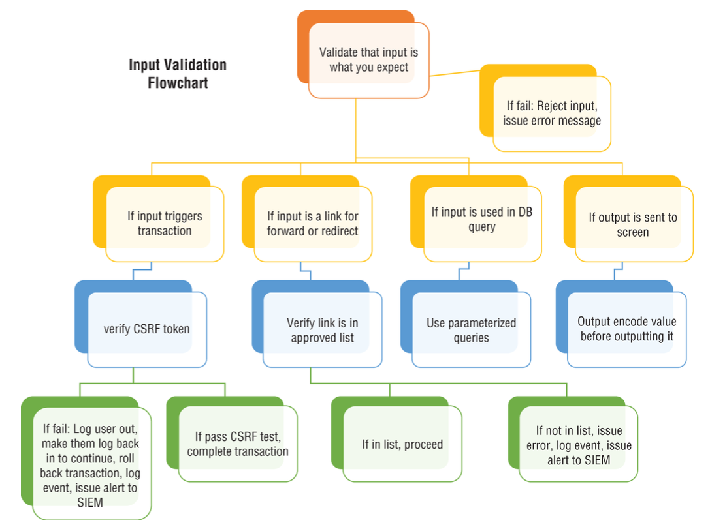

# Secure Design

### input validation flow chart:

- always use safe html for id's shown in ui
### Session management
- Use the built-in session management implementation in your framework, if one exists.
- The session ID should have an expiration date and/or time; it cannot last forever, even
if the user is still logged in.
- The session ID should only be passed over encrypted channels.
- The session should be destroyed after a user logs out.
- Web applications must never accept a session ID they have never generated. In the
case of receiving one, this scenario must be detected and logged as a suspicious
activity; an alert should be generated and the IP blocked. This constitutes a security
incident.
- Session IDs should be regenerated during authentication, re-authentication, or any
other event that changes the level of privilege with the associated user.
