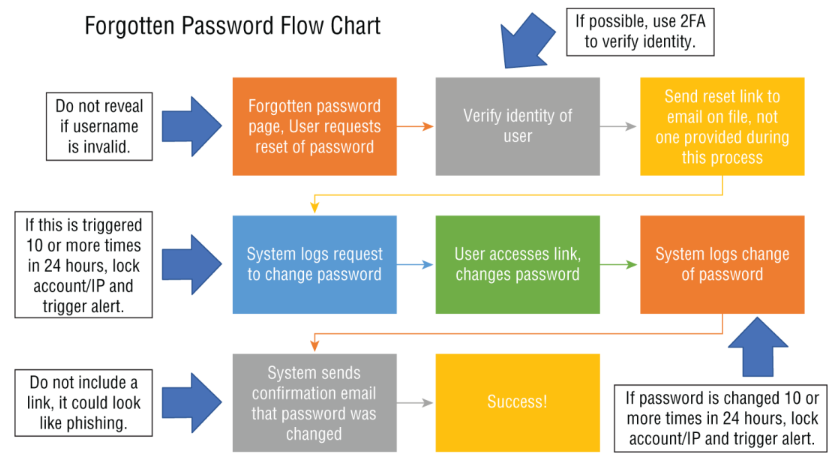

# Security Requirement

### encryption
- Encryption is two-way, in that you can jumble up the information into an
unreadable mess, and then “decrypt” it back into its original form. Hashing is one-way; the original value can never be recovered.
- the data as it flows between the application and the API should be encrypted to protect the privacy of your user.
- any data that gets transmitted should be encrypted
### never trust system input
- Input to your application means literally anything and everything that is not a part of your application or that could have been manipulated outside of your application.
eg: User input on the screen (for instance, entering search phrases into a field),
Information from a database (even the database you designed for your app) 
- anything that comes from outside validate and sanitize
- if we write an application in a non memory safe language do a bounds checking to make sure it doesnt overflow. attackers can buffer overflow (overwrite parts of memory) which not handled would crash our application
- There is no purpose in performing validation of the data after you have used it. It must be the very first thing you do after receiving input into your application.
- When issuing an error message to the screen to reject user input,
if you decide to show the user’s input, be aware that it may be malicious
and therefore potentially cause your program to malfunction. Always
encode the output using HTML encoding
- ndefault administrator group
- we create sub org org admin group
- that obj should be in obj table
- while sharing we will 
- obj table new record
- find out risk preset we are doing (owner
find what all the child arg, create stsme name, group id find., use that )

- Verifying that all third-party components are not known to be vulnerable is a quick-and-easy win in
regard to understanding how secure your application is
- **various statergies to verify known vulnerabilites in third-party components:**
  - use more than 1 tool to check verify. different tools check different stuff so more than 1 tool is preferable
  - regularly scan our code repository  (daily, or at least weekly), as well as scan every time
you release code to production. try building this pipeline into your ci/cd

### Security Headers: Seatbelts for Web Apps
- [security headers](security_headers.md)

### Securing Your Cookies
- [secure cookies](secure_cookies.md)

### Passwords, Storage, and Other Important Decisions
- password manager+mfa+ different passoword for everyting is the ultimate protection
- What about the passwords of the users of your application? Where should those be stored?
They should be stored in the database (or other centralized place of management such as
an identity provider), in a salted and hashed format.
- user's password hash+ salt and store it in db
(hash is one way so cant decrypt)
- **salting** is
adding a unique, long value to a value before you hash it, in order to increase entropy and
to make it even more difficult for a potential attacker to crack or guess a password.
- we can store our salt in db as well. because the main use of salt is not to use it as a secret.
-  The purpose of a salt is not to make the hash impossible to crack on its own but to make each password hash unique and defend against:
- Rainbow table attacks: Precomputed hash lookup tables.
- Identical password detection: Without salts, users with the same password would have the same hash.
- If the attacker gets both the salt and hash:
  - They still need to brute force the password for each user individually.
  - This is much slower than rainbow table attacks.
- newer techniques like  **work factor** and **peppering** makes it even more harder to crack the password.
- A **work factor** means that you repeat the hashing algorithm X amount of times, with X being the work factor.
- **Peppering**, or a cryptographic pepper, is similar to a salt in that it is added to a password before the password is hashed and it should be generated by a secure random
number generator. However, a pepper is a secret and should not be stored in the database
like a salt, it should be quite long
(minimum 32 characters but preferably 128), and the pepper is unique for each
application, but the same for all users of that application.
- It is possible to both salt and pepper your passwords; however, generally only a salt is required for most systems.
- note that if you rotate the pepper all the passwords are now invalid and the user needs to reset their password with the new pepper
https://haveibeenpwned.com/ useful website to check if your email has been breached
- Never verify if it was the username or password that was incorrect when alerting the user
that they have failed when logging in. Giving this information away allows potential
attackers to harvest usernames (verifying that a user does or does not use your system).
- Security questions are not a modern verification method as most
users select questions for which the answer is publicly available (on social
media, for instance), and thus security questions should be avoided if
possible. example of security questions are whats your favourite color and so on
 
---
- If your framework offers a security feature, use it. do not write anything on your own and try to use the language's packages as much as possible as they are tested, used by a huge population.
---
### File upload
must read: https://cheatsheetseries.owasp.org/cheatsheets/File_Upload_Cheat_Sheet.html

- Allowing members of the public (as
opposed to authorized users from within your own organization) to upload files is the
riskiest software functionality that common applications will ever perform.
- When accepting an uploaded file from a user, assume the worst.
- Verify its type and size,
rename the file, do not allow the user to set the path as to where it would be stored, and
store it in a safe place away from the rest of your application and web server. 
- Change the filename to something generated by the application
- Once you
have accepted the file, scan it with at least one tool that can verify if the file is questionable.
- Restrict the files to only specific types that are less
dangerous. For instance, accept JPG, TXT, and PNG, but do not accept PDF or EXE file
types.
- ZIP files are not recommended since they can contain all types of files, and the attack vectors pertaining to them are numerous.
- Malicious file uploads are such a serious and crucial topic that the Canadian government’s
cyber security arm, the Communications Security Establishment of Canada (CSE), created
and open-sourced a free tool to check uploaded files; it is called AssemblyLine
( cyber.gc.ca/en/assemblyline ). It does not share information back to the Canadian
government like many other online tools that are available for no financial cost online.
---
### Error and Logging
https://cheatsheetseries.owasp.org/cheatsheets/Error_Handling_Cheat_Sheet.html
- log all the error
- log all the traces if possible
- never show the actual error in the ui. it doesnt look professional as well as attackers shouldnt get additional information
- never log sensitive information such as passwords. Any combination of information that combined would make personally
identifiable information (PII) should not be logged.
---
### Input Validation and Sanitization
- validate: input is one among the character in allow list
- sanitize: remove unwanted spaces,escape characters, transform the input which we got into whatever we feel more secure
- always vaildate and sanitize at the server. this is because after triggering a js at client side the request can be redirected to a web proxy, changed and then reach the server. so validating at front end is not enougt.
- allways have a allow list not block list. by default block everything and then allow what all are needed
- Your **approved list** should be written with regular
expressions (regex), and anything not matching your expression is not allowed. For
example, if you wanted to allow only a–z and A–Z for a username, you could use this
expression: ^[a-zA-Z]{1,10}$.
