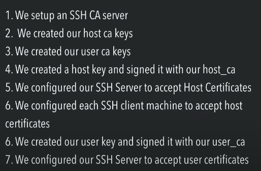

# ssh certificates:
https://www.youtube.com/watch?v=GQtsIe6ZgH4

## best practices:
- host ca and user ca should be seperate. this is because in case of private key compromize you just have to issue host ca or user ca again not both.
- no not never ever share private key
---
- we need to sign the generated key with ca's private key to generate the certificate
- for host certficates we sign with host ca's key and for user certficates we sign with user ca's key


### how things works:
- let us assume: I have 1 machine which is certificate authority, 2 machines and 1 user. I want the user to acess both the machines using certificate based ssh. how
**so here we just have 1 CA for both user and host**
#### overview of workflow:
- The Certificate Authority (CA) signs public keys for the user, granting access to the machines.
- The machines are configured to trust the CA, verifying the certificates issued by it.
- The user uses their signed certificate to authenticate with the machines.
#### steps to implement:
##### 1. Set Up the Certificate Authority (CA):
- Log into the CA machine.
- Generate a CA key pair:
```bash
ssh-keygen -f /etc/ssh/ssh_ca -C "Certificate Authority" -N ""

```
**/etc/ssh/ssh_ca:** Path to the CA private key.
**/etc/ssh/ssh_ca.pub:** CA public key.

##### 2. Configure Machines to Trust the CA:
On both machines (Machine 1 and Machine 2):

- Copy the CA's public key (ssh_ca.pub) to each machine.
- Add the CA public key to **/etc/ssh/sshd_config:**
```bash
TrustedUserCAKeys /etc/ssh/ssh_ca.pub
```
- Restart the SSH service:
```bash
sudo systemctl restart sshd
```

##### 3. Create the User's Key Pair:
On the user's machine:
- Generate an SSH key pair:
```bash
ssh-keygen -f ~/.ssh/id_rsa_user -C "user@yourdomain.com"

```
**~/.ssh/id_rsa_user:** User's private key.
**~/.ssh/id_rsa_user.pub:** User's public key.

##### 4. Sign the User's Public Key:
On the CA machine:
- Copy the user's public key (id_rsa_user.pub) to the CA machine.
- Sign the user's public key:
```bash
ssh-keygen -s /etc/ssh/ssh_ca -I user_certificate -n <username> -V +30d ~/.ssh/id_rsa_user.pub

```
**-s** /etc/ssh/ssh_ca: Path to the CA private key.
**-I** user_certificate: Certificate Identifier.
**-n** <username>: Restrict the certificate to <username> on the remote machine.(optional for example user@yourdomain.com)
**-V** +30d: Valid for 30 days.
- Provide the signed certificate (id_rsa_user-cert.pub) to the user.
##### 5. Configure the User's SSH Client:
On the user's machine:
- Add the CA public key and certificate to ~/.ssh/config:
```bash
Host machine1
    Hostname <machine1-ip>
    User <username>
    IdentityFile ~/.ssh/id_rsa_user
    CertificateFile ~/.ssh/id_rsa_user-cert.pub

Host machine2
    Hostname <machine2-ip>
    User <username>
    IdentityFile ~/.ssh/id_rsa_user
    CertificateFile ~/.ssh/id_rsa_user-cert.pub


```
##### 6. Test the Connection:
From the user's machine, connect to Machine 1:
```bash
ssh machine1
```

```bash
              ┌────────────────┐        ┌────────────────┐
              │ User Machine   │        │ CA Machine     │
              │                │        │                │
              │ Generate       │        │ Generate CA Key│
              │ Key Pair       │        │ Sign User Key  │
              └─────┬──────────┘        └──────┬─────────┘
                    │                           │
                    │ Provide Public Key        │
                    │                           │
                    ▼                           ▼
    ┌──────────────────────────────────────────────────────┐
    │                      Machines (SSH Servers)          │
    │                                                      │
    │ Trust CA Public Key (TrustedUserCAKeys /etc/ssh_ca)  │
    │ Verify User Cert (id_rsa_user-cert.pub)              │
    └──────────────────────────────────────────────────────┘
```

----

# Setting Up SSH with Two Certificate Authorities (User CA and Host CA)
#### this is the best practice
## Overview of Workflow

1. **User CA**: Signs user public keys to authenticate users
2. **Host CA**: Signs host public keys to authenticate servers
3. Machines trust the Host CA for server authentication, and the User CA for user authentication

## Steps to Implement

### 1. Set Up the Certificate Authorities (CAs)

#### On the User CA machine:

```bash
ssh-keygen -f /etc/ssh/user_ca -C "User Certificate Authority" -N ""
```

This creates:
- `/etc/ssh/user_ca` (private key)
- `/etc/ssh/user_ca.pub` (public key)

#### On the Host CA machine:

```bash
ssh-keygen -f /etc/ssh/host_ca -C "Host Certificate Authority" -N ""
```

This creates:
- `/etc/ssh/host_ca` (private key)
- `/etc/ssh/host_ca.pub` (public key)

### 2. Sign Host Keys with Host CA

On each host machine (Machine 1 and Machine 2):

1. Generate a host key pair:
   ```bash
   ssh-keygen -f /etc/ssh/ssh_host_rsa_key -N ""
   ```

2. Copy the host's public key (`ssh_host_rsa_key.pub`) to the Host CA machine

3. Sign the host key with the Host CA:
   ```bash
    sudo ssh-keygen -s /etc/ssh/host_ca -I pi -h -V +1w /etc/ssh/pi_ssh_host_rsa_key.pub

   ```
   - `-h`: Indicates this is a host certificate
   - `-I host_machine1`: Identifier for the host
   - `-V +1y`: Certificate is valid for 1 year

4. Place the signed certificate (`ssh_host_rsa_key-cert.pub`) back on the host machine at `/etc/ssh/`

5. Configure sshd on each host machine:
   ```bash
   # Update /etc/ssh/sshd_config
   HostCertificate /etc/ssh/ssh_host_rsa_key-cert.pub
   
   # Restart SSH
   sudo systemctl restart sshd
   ```
you can configure principal,host  user ca's certs in ssd config
```bash
TrustedUserCAKeys /etc/ssh/AuditCue_Tech_cert.pub
AuthorizedPrincipalsFile /etc/ssh/auth_principals/%u


## in terminal
[ec2-user@ip-172-128-8-102 ssh]$ cd auth_principals/
[ec2-user@ip-172-128-8-102 auth_principals]$ ls -
ls: cannot access '-': No such file or directory
[ec2-user@ip-172-128-8-102 auth_principals]$ ls -l
total 4
-rw-r--r--. 1 root root 7 Feb 22  2024 ec2-user
[ec2-user@ip-172-128-8-102 auth_principals]$ cat ec2-user 
devops
[ec2-user@ip-172-128-8-102 auth_principals]$
```
### 3. Configure Hosts to Trust the Host CA

On all machines, including the User CA machine:

1. Copy the Host CA's public key (`host_ca.pub`) to each machine
2. Add it to `/etc/ssh/ssh_known_hosts` for server authentication:
   ```bash
   @cert-authority * ssh-rsa AAAAB3... host_ca.pub
   ```

### 4. Sign User Keys with User CA

On the User CA machine:

1. Receive the user's public key (`id_rsa_user.pub`)
2. Sign the user key:
   ```bash
   ssh-keygen -s /etc/ssh/user_ca -I user_certificate -n <username> -V +30d ~/.ssh/id_rsa_user.pub
   ```
   - `-s /etc/ssh/user_ca`: Path to User CA private key
   - `-n <username>`: Restrict certificate to specific username
   - `-V +30d`: Certificate is valid for 30 days

3. Provide the signed certificate (`id_rsa_user-cert.pub`) to the user

### 5. Configure Machines to Trust the User CA

On Machine 1 and Machine 2:

1. Copy the User CA's public key (`user_ca.pub`) to each machine
2. Update `/etc/ssh/sshd_config`:
   ```bash
   TrustedUserCAKeys /etc/ssh/user_ca.pub
   ```
3. Restart SSH:
   ```bash
   sudo systemctl restart sshd
   ```

### 6. Configure the User's SSH Client

On the user's machine:

1. Add the host CA to `~/.ssh/known_hosts`:
   ```bash
   @cert-authority * ssh-rsa AAAAB3... host_ca.pub
   ```
this step is optional and it is automatically done when you try to ssh into the machine

2. Configure the user's `~/.ssh/config`:
   ```ssh-config
   Host machine1
       Hostname <machine1-ip>
       User <username>
       IdentityFile ~/.ssh/id_rsa_user
       CertificateFile ~/.ssh/id_rsa_user-cert.pub

   Host machine2
       Hostname <machine2-ip>
       User <username>
       IdentityFile ~/.ssh/id_rsa_user
       CertificateFile ~/.ssh/id_rsa_user-cert.pub
   ```
this step is optinal as well so ssh quickly. all you need to do after configuring this is to run Host machine2
## System Architecture

```
               ┌────────────────┐
               │   User CA      │
               │   Signs User   │
               │   Certificates │
               └──────┬─────────┘
                      │
               ┌──────┴──────────┐
               │                 │
   ┌───────────▼────────────┐ ┌──▼────────────┐
   │    User Machine        │ │    Host CA     │
   │  Uses Signed Cert      │ │  Signs Host    │
   │  To Access Hosts       │ │  Certificates  │
   └──────────┬──────────────┘ └─────┬─────────┘
              │                       │
   ┌──────────▼───────────┐   ┌──────▼──────────┐
   │ Machine 1 (SSH Server)│   │ Machine 2 (SSH Server)│
   │ Trusts User CA & Host │   │ Trusts User CA & Host │
   │ Authenticates Users   │   │ Authenticates Users   │
   └───────────────────────┘   └───────────────────────┘
```

## Best Practices for Two CAs

### Key Segmentation
- Use separate machines or secure storage for User CA and Host CA private keys

### Key Protection
- Restrict access to CA private keys with strict permissions

### Key Rotation
- Rotate both User CA and Host CA keys periodically

### Short-lived Certificates
- Issue short-lived certificates for users to reduce the risk of compromise

### Auditing and Logging
- Enable logging on SSH servers to monitor certificate-based logins and host authentications

---
#### config example:
```bash
Host machine1
    Hostname 192.168.1.10
    User ubuntu
    IdentityFile ~/.ssh/id_rsa_user
    CertificateFile ~/.ssh/id_rsa_user-cert.pub

Host machine2
    Hostname 192.168.1.20
    User root
    IdentityFile ~/.ssh/id_rsa_user
    CertificateFile ~/.ssh/id_rsa_user-cert.pub
```
his configuration ensures:

- Secure user authentication using a certificate signed by the User CA.
- Secure host verification using a certificate signed by the Host CA.
- A simplified and secure SSH connection process for the user.

##### 1. Host
Each Host block specifies the settings for connecting to a particular remote server. The term "host" here refers to a remote machine you are connecting to using SSH. Each block is dedicated to one machine (e.g., machine1 or machine2).

#### 2. Components of the Configuration
##### a. Host
Specifies the alias or name used in the configuration to identify a remote machine.
Example: Host machine1 or Host machine2.
When you run ssh machine1 or ssh machine2, the settings in the corresponding block will apply.
##### b. Hostname
Specifies the actual IP address or domain name of the remote machine.
Example: <machine1-ip> is the IP address or FQDN (e.g., 192.168.1.10 or example.com).
- this is nessary because this will verify the credibility of host certificate which is provided by host CA to this user. 
`/etc/ssh/ssh_known_hosts` for server authentication:
   ```bash
   @cert-authority * ssh-rsa AAAAB3... host_ca.pub
   ```
   this * here allows all but we can configure that 
##### c. User
Specifies the username you will use to log in to the remote machine.
Example: <username> could be root, ubuntu, or any valid user on the remote machine.
##### d. IdentityFile
Specifies the path to the user's private SSH key.
Example: ~/.ssh/id_rsa_user refers to the private key of the user that corresponds to the certificate (id_rsa_user-cert.pub).
##### e. CertificateFile
Specifies the path to the SSH certificate signed by the User CA.
Example: ~/.ssh/id_rsa_user-cert.pub is the certificate file that proves the identity of the user, signed by the User Certificate Authority (User CA).

#### How the Configuration Works Together
##### Authentication Flow:
- When you run ssh machine1, the SSH client uses the ~/.ssh/id_rsa_user private key and the ~/.ssh/id_rsa_user-cert.pub certificate to prove your identity.
- The certificate is validated by the remote host against the trusted User CA key.
##### Host Verification:
- The SSH client verifies the remote server (e.g., machine1) using the Host Certificate (ssh_host_rsa_key-cert.pub) signed by the Host CA.
##### Trust Relationship:

- The remote machine trusts the User CA to verify the user’s certificate.
- The SSH client trusts the Host CA to verify the host's certificate.
---
## Verifying the Legitimacy of a Host (`<machine1-ip>` or `example.com`)

The legitimacy of the hostname (`<machine1-ip>` or `example.com`) is verified using the **host certificate** issued by the **Host CA**. Here’s a detailed explanation:


## **Verification of Host Legitimacy**

### 1. **Host Key and Certificate**
- Each host (e.g., `machine1` and `machine2`) has a private/public key pair:
  - `ssh_host_rsa_key` (private key).
  - `ssh_host_rsa_key.pub` (public key).
- The host’s public key is signed by the **Host CA**, creating a host certificate (`ssh_host_rsa_key-cert.pub`).

### 2. **Trusted Host CA**
- The SSH client is configured to trust the **Host CA** by adding the Host CA's public key to its `known_hosts` file or through configuration (`TrustedHostKeys` or `@cert-authority` directives).

### 3. **During Connection**
- When the user initiates an SSH connection:
  - The server provides its signed host certificate (`ssh_host_rsa_key-cert.pub`) to the client.
  - The client verifies the certificate using the trusted **Host CA** public key.

### 4. **Legitimacy Checks**
The SSH client performs the following checks:
- **Hostname Match**: Ensures the hostname in the certificate matches the hostname of the server (`<machine1-ip>` or `example.com`).
- **Expiration Date**: Ensures the certificate is not expired.
- **Signature Validation**: Verifies that the certificate was issued by the trusted Host CA.

### 5. **Trust Decision**
- If the certificate passes all checks:
  - The SSH client trusts the host and establishes the connection.
- If the certificate is invalid:
  - The connection is terminated, and the client displays a warning.

---

## **How This Prevents Attacks**

### 1. **Man-in-the-Middle (MITM) Attack Prevention**
- An attacker cannot forge a valid host certificate without the Host CA’s private key.
- If an attacker presents a fake hostname or certificate, the client will detect the mismatch and terminate the connection.

### 2. **Impersonation Protection**
- Only the legitimate host, with a private key corresponding to its signed certificate, can present a valid host certificate.

---

## **Key Configuration on the Client**

To trust the **Host CA**, add the following entry to your `~/.ssh/known_hosts` file:

```plaintext
@cert-authority *.example.com ssh-rsa AAAAB3NzaC1yc2EAAAABIwAAAQEArandomHostCAPublicKey
```

- add tustedhostca in sshdconfig path to public key ca
