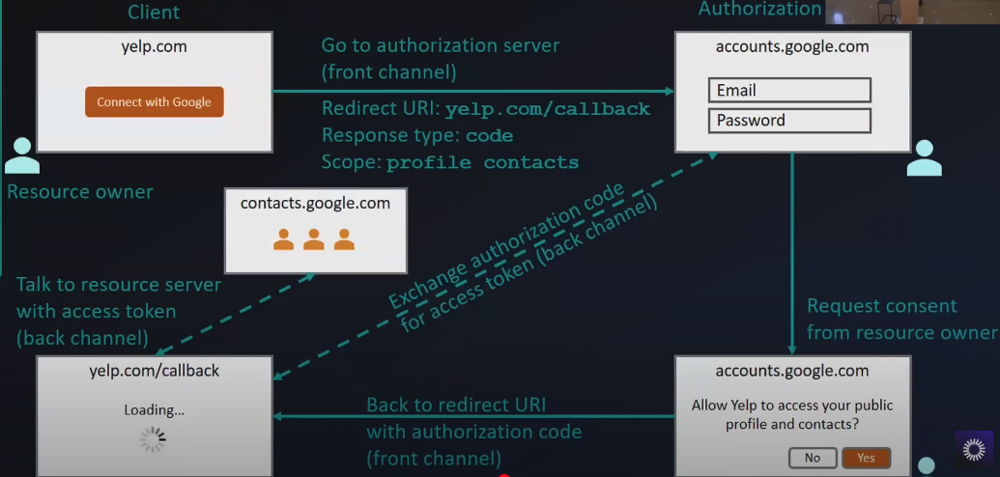

# OAuth 2.0 and OpenID Connect (OIDC)  

> **Goated video**: https://www.youtube.com/watch?v=996OiexHze0  
> **PPT**: https://drive.google.com/file/d/1UyPqnrGnCCJ7PeIY-rDV-3tRprIEprBB/view?usp=sharing  

     +--------+                               +---------------+
     |        |--(A)- Authorization Request ->|   Resource    |
     |        |                               |     Owner     |
     |        |<-(B)-- Authorization Grant ---|               |
     |        |                               +---------------+
     |        |
     |        |                               +---------------+
     |        |--(C)-- Authorization Grant -->| Authorization |
     | Client |                               |     Server    |
     |        |<-(D)----- Access Token -------|               |
     |        |                               +---------------+
     |        |
     |        |                               +---------------+
     |        |--(E)----- Access Token ------>|    Resource   |
     |        |                               |     Server    |
     |        |<-(F)--- Protected Resource ---|               |
     +--------+                               +---------------+
     
- OAuth 2.0 for authorization  
- OpenID Connect for authentication  

## Authorization vs. Authentication  

### Authentication:  
- Authentication is the process of verifying the identity of a user, system, or entity. It ensures that the person or system is who they claim to be.  

### Authorization:  
- Authorization determines what permissions an authenticated user has.  
- It is the process of defining what an authenticated user or system is allowed to access or do.  

### Analogy:  
- **Authentication**: Showing your ID to prove who you are.  
- **Authorization**: Being allowed into a restricted area based on your ID.  

| **Aspect**            | **Authentication**                          | **Authorization**                          |  
|------------------------|---------------------------------------------|--------------------------------------------|  
| **Purpose**            | Verifies identity                           | Grants or restricts access                 |  
| **When it happens**    | Before authorization                        | After authentication                       |  
| **Mechanisms**         | Passwords, biometrics, MFA                  | Role-based access control (RBAC), permissions |  
| **Example**            | Logging into a system                       | Accessing specific files or features       |  

  

- OAuth 2.0 takes advantage of both the back and front channels.  

### Backchannel and Front Channel  
- The **front channel** is used for user-facing interactions and operates through the browser, while the **back channel** is used for secure server-to-server communication.  
- The **back channel** uses POST requests and is more secure than the front channel because:  
  - All communication is encrypted with HTTPS.  
  - The client application authenticates itself using a client secret.  
  - Sensitive data (e.g., authorization code, access token) is never exposed to the browser.  
  - Authorization codes are short-lived, reducing the risk of misuse.  
- In contrast, the **front channel** is less secure because:  
  - It relies on the browser to transmit sensitive data (e.g., authorization code) via redirects.  
  - The browser is a public environment and is more vulnerable to attacks (e.g., man-in-the-middle, phishing, or malicious extensions).  
  - The client application has no control over the security of the browser or the network.  

  

- The **user interaction** part is done using the front channel (browser), but since we can't fully trust the browser, we use the back channel for the final part of the flow—**access token exchange and resource retrieval**.  

---

## OAuth 2.0 Authorization Code Flow  

### Forward Channel (Less Secure)  
1. The user clicks "Sign in with Google" on the client application.  
2. The client app redirects the user's browser to Google's authorization server.  
3. The user logs in and consents to the requested permissions.  
4. Google redirects the user's browser back to the client app with an authorization code in the URL (redirect URI or callback).  

**Risk:** The authorization code is exposed to the browser and could be intercepted. However, this alone is not useful because an authorization code alone cannot be used to access resources. An **access token** is required, which can only be obtained by providing both the authorization code and a client secret.  

### Back Channel (More Secure)  
1. The client app takes the authorization code and sends it directly to Google's token endpoint via a **POST request** (over HTTPS).  
2. The **POST request is encrypted** with HTTPS, and the client app authenticates itself using a **client secret**.  
3. Google responds with an **access token**, which is securely transmitted over HTTPS and never exposed to the browser.  

```bash
POST /token HTTP/1.1
Host: authorization-server.com
Content-Type: application/x-www-form-urlencoded

grant_type=authorization_code
&code=AUTH_CODE
&redirect_uri=https://client-app.com/callback
&client_id=CLIENT_ID
&client_secret=CLIENT_SECRET
```

---

## OAuth 2.0 is for Authorization, Not Authentication  

- OAuth was never designed for **authentication** it was designed for **authorization**.  
- OAuth 2.0 checks the **scope** of an authenticated user (which is authorization).  
- It uses **access tokens** to grant access to resources. These tokens are short-lived and scoped to specific permissions (e.g., read-only access to emails).  
- OAuth 2.0 does **not inherently verify the user’s identity**; it only ensures that the application has permission to access requested resources.  

### Why OAuth 2.0 Is Not for Authentication  

#### 1. Lack of Identity Verification  
- OAuth 2.0 does not provide a standard way to verify a user's identity. It only provides an **access token**, which does not inherently contain identity information.  

#### 2. Misuse for Authentication  
- Many developers misuse OAuth 2.0 for authentication by assuming that the presence of an access token implies the user's identity has been verified. This can lead to security vulnerabilities.  
- If an attacker steals an access token, they could impersonate the user without ever verifying their identity.  

#### 3. Inconsistency in Authentication Implementation  
- OAuth 2.0 does not define how user information (e.g., name, email) should be retrieved, leading to inconsistencies.  
- Different platforms implement their own authentication layers on top of OAuth, which is **not the standard practice**.  

Let's consider an example:
- Suppose your app allows users to sign in using Google and view their private dashboard.
- If you only use OAuth:
The user authorizes your app to access their Google Contacts API.
- Google sends an Access Token to your app.
- Your app can use this access token to fetch contacts from Google.
- However, this access token does not prove who the user is. it only grants permission to access data.
- Anyone who gets the Access Token (attacker or legitimate user) can access the Google Contacts API without proving their identity.
- Now, suppose you integrate only OAuth for your client app authentication:
  - The user authorizes your app to access their Google Profile API.
  - Google sends an Access Token.
  - Your app uses this token to fetch the user's profile information (like name and email).
  - Based on this fetched data, your app assumes the user is authenticated.
  - he access token does not guarantee that the user requesting the profile is the real user. it only shows that someone authorized the app.
  - If an attacker gets the access token, they can fetch the same user profile data without proving their identity.
  - The app is simply trusting the API response without verifying if the token really represents the user.

---

## OpenID Connect (OIDC)  

To solve the problem of **needing user identity verification**, **OIDC** adds an authentication layer on top of OAuth 2.0.  

### **OIDC Enhancements**  

1. **ID Tokens (JWTs)**  
   - OIDC introduces **ID tokens**, which are JSON Web Tokens (JWTs) containing user identity information (e.g., name, email).  
   - These tokens are signed and can be verified to ensure the user's identity.  

2. **Standardized User Info**  
   - OIDC provides a standard way to retrieve user information using the `/userinfo` endpoint.  

3. **Authentication Flow**  
   - OIDC follows OAuth 2.0 flows but adds an **ID token** alongside the **access token**.  

### **OIDC vs. OAuth 2.0**  

| **Step**               | **OAuth 2.0**                              | **OpenID Connect (OIDC)**                  |  
|-------------------------|--------------------------------------------|--------------------------------------------|  
| **Token Issued**        | Access token                              | Access token + ID token                    |  
| **Identity Information**| Not included in the access token          | Included in the ID token                   |  
| **User Info Retrieval** | Requires additional API call to `/userinfo`| ID token contains user info; `/userinfo` is optional |  
| **Use Case**            | Accessing Google Drive or Gmail           | Logging into a website using "Sign in with Google" |  

  
---
##  Reason why oauth isnt enough for authentication and Combination of oauth +oidc is the way to go
- The flow goes like this:
- User logs in via Google or whatever identity provider. for this example we will use google.
- Google (OIDC Provider) authenticates the user.
- Google sends two tokens to your app:
  - Access Token (for accessing Google APIs like Contacts or Calendar)
  - ID Token (for authenticating the user identity)
  - The ID Token contains:
  sub: Unique user ID (Google's internal user ID)
  email: User's email address
  name: User's name
  iat & exp: Token issued time & expiry time
  Other user details
  - our app backend will verify the jwt id token 
  - if valid we authenticate.

#### Why Is the ID Token Trustworthy?
- The ID Token is digitally signed by Google using a private key.
- Your backend can verify this signature using Google's public keys.
- If the signature is valid, you know:
  - The token is not tampered.
  - The token is issued by Google.
  - The user identity is genuine.
#### What Happens if Someone Steals the Access Token?
- **if we have only implemented oauth:**
  - The access token can be used to access APIs but does not prove user identity.
  - The access token can be granted to any client app that the user has authorized, not necessarily your app.
  - The access token does not contain identity information like email or user ID.
  - Resource servers using the access token do not verify the user's identity, only the token's validity.
  - so if you have this access token you can get into the system because you are authorized

- **if we have implemented oidc on top of oauth:**
  - The access token alone cannot be used to prove identity.
  - The attacker would need the ID Token + private key verification to impersonate the user
  - this id token is generated using the scope openid and it is generated only once. just at the time of login. we cannot generate again with just the access token. so if someone gets our access token since they cant get out id token we are safe with oidc.
- Access Token and ID Token Are Issued Separately
- The Access Token is meant for API resource access (like Google Contacts or Calendar). this is oauth flow.
- The ID Token is only issued during the initial OIDC authorization flow, specifically when the openid scope is requested.
- The ID Token is not retrievable via any API endpoint. it's only given once during the login flow.
- Access Token Is for APIs, Not Identity
- Access tokens are typically sent to resource servers (like Google Contacts API).
- Resource servers never return ID Tokens. they only allow access to the requested resources. which is the oauth flow.

#### What If the Attacker Steals Both Tokens?
Yes, if the attacker steals both the Access Token and ID Token simultaneously, they can access the app for the ID Token's lifetime (5-10 mins).

However, this risk is minimized by:
- Short expiration of ID Tokens.
- Backend verification of signature, audience, and expiration on every request.
- OIDC providers often include:
  - Nonce (Random value to prevent token reuse)
  - aud claim (Token is valid only for the app that requested it)
  - iat claim (Issued At time)
  - If the attacker reuses the same ID Token later, the nonce check will block the request.
---

## Refresh Tokens  

### Purpose of Refresh Tokens  
- Used to obtain a new **access token** when the current one expires.  
- Maintains long-term access to APIs without requiring the user to log in repeatedly.  

### Key Points  
- **Refresh tokens don’t expire** (but can be revoked).  
- Must be stored securely (e.g., database/encrypted storage).  
- Issued **only once** during the first authorization.  
- Provided when requesting **offline access**.  
- A single refresh token can be used multiple times to obtain new access tokens.  

### When Is a Refresh Token Used?  
- Google’s access tokens typically expire after **1 hour**.  
- If an API request fails with a `401 Unauthorized` response, the app uses the **refresh token** to get a new access token.  

### Benefits of Refresh Tokens  
- **Longer login sessions** for users.  
- **More secure** than storing long-term access tokens.  
- **Better user experience** (fewer re-logins).  
- **Required for offline access** to user data.  

Even when an **access token expires**, the user **remains logged in**, but API calls will fail until a new token is obtained.
