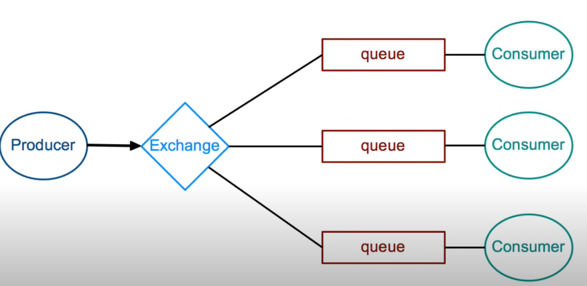

# rabbit mq

https://www.youtube.com/watch?v=deG25y_r6OY
https://www.youtube.com/watch?v=1yC_bw0tWhQ
- it is a message broker
 
- it has the following parts:
  - producter- 	Sends messages to RabbitMQ
  - exchange- Routes messages to one or more queues
  - binding- Link between an exchange and a queue
  - Routing Key- A label used by exchanges to route messages
  - queue- Stores messages until they are consumed
  - consumer- Receives messages from RabbitMQ
### types of exchange:

- #### Direct
- #### Topic
- #### fan out
- #### headers
- #### the default one specific to rabbit mq

### note:
- recreate the channels for each concorruent connection but reuse the connection. always have 1 connection for paticular service and spawn multpiple channels from that
- if the queue is set durable then they will persist even if rabbimq restarts
- 